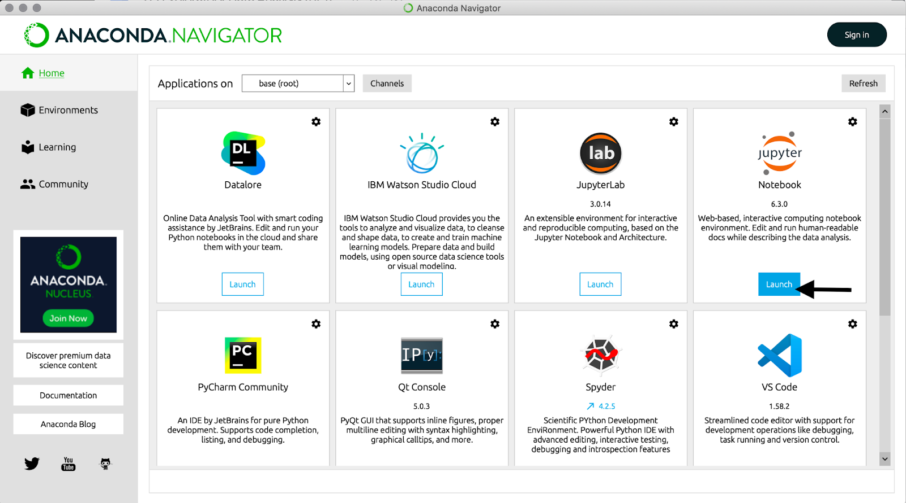
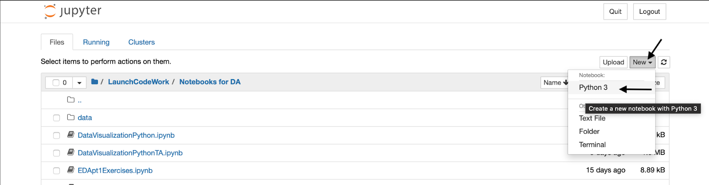
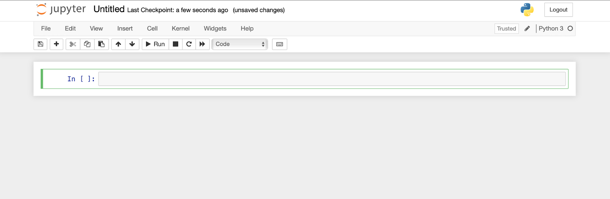

.. _anaconda-setup:

Setting Up Anaconda
===================

As you deepen your Python skills and move into Exploratory Data Analysis, you'll need more powerful tools!
Anaconda is an open-source, entirely free distribution system that consolidates these tools into one simple package.
When you download and install Anaconda for Mac, Windows or Linux, you will gain access to Jupyter Notebook, an app that allows you to edit your Python code, add notes and incorporate visuals.
You can also access different Python libraries that will give you more powerful data cleaning, analysis and visualization tools.

To get started, download and install `Anaconda <https://anaconda.com/products/individual>`__. 
When you follow the link it selects the download that best suits your system.  You should be able to just click the download button and follow the instructions.
We suggest creating a folder on your desktop for data analysis projects to make importing libraries and files easier.
Remember to shut down your kernel (how Jupyter notebooks run) when done.

Using Jupyter Notebooks
-----------------------

With Anaconda installed, open Anaconda Navigator and launch Jupyter Notebook (not JupyterLab).
 

Launching Notebook opens a new window in your browser. Create a new Python 3 notebook 

 
Jupyter Notebooks consist of ‘cells’ by default, a new empty cell will be a “code”(python) cell. When highlighted green, a cell is being edited and ready to run. To run the code in an active cell, hit the “run” button. 

 
Check out this `tutorial <https://github.com/codinglikeagirl42/Intro_To_Juypter_Notebooks/blob/9abe679f856092f62fdc908368b972498774cdc5/Intro%20To%20Jupyter%20Notebooks.ipynb>`__ for a more detailed introduction to Jupyter Notebook.

