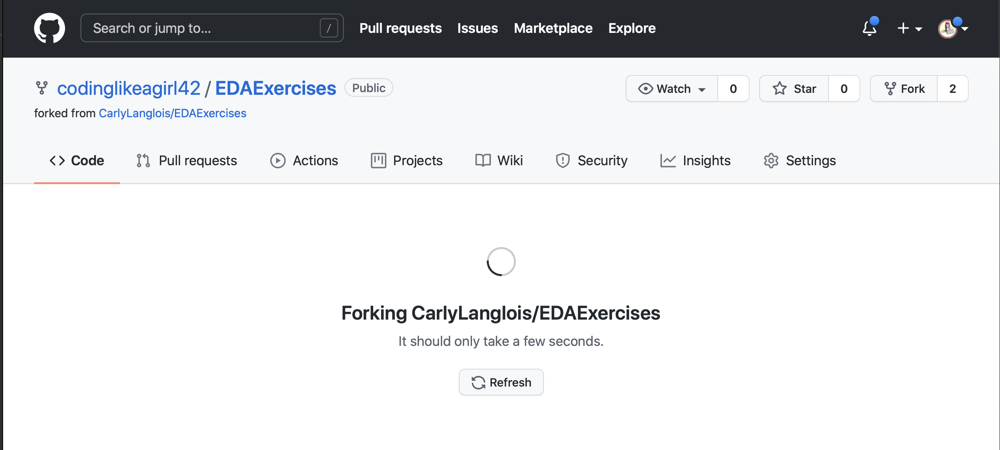
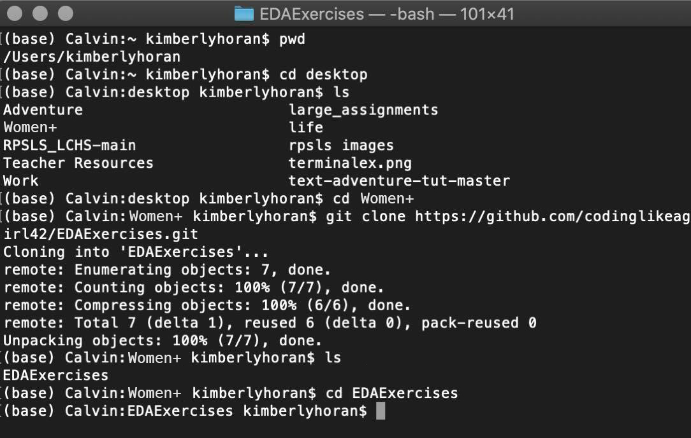

.. _usingGitHubNotebooks:

Instruction for Using Github w/Jupyter Notebooks
================================================

Welcome to Git!
---------------

Git is the most common version control system used in the tech industry 
today. After Assignment 1(submitted in Replit), you will submit your 
exercises, studios and assignments using Github.

This will help your mentors access your code more easily and will help 
you practice a valuable industry skill.

Set up your own Github account `here <https://github.com/signup?ref_cta=Sign+up&ref_loc=header+logged+out&ref_page=%2F&source=header-home>`__.
or if you already have an account `sign in here <https://github.com/login?return_to=https%3A%2F%2Fgithub.com%2Fsignup%3Fref_cta%3DSign%2Bup%26ref_loc%3Dheader%2Blogged%2Bout%26ref_page%3D%252F%26source%3Dheader-home>`__.

When you click a link to the git notebooks in the instructions, it will 
take you to the repository page and will look something like this.

In the upper right corner your will see the fork button, when you click it you will then see this:

Choose your account and then you’ll see:

Choose your account and then you’ll see:

.. figure:: figures/forking2.png
   :alt: A screenshot of what you'll see when the forking process is over.

#. Notice that instead of CarlyLanglois/EDAExercises the repo has your name now .  
#. Next step is to click on the Code button
#. Copy the link to your repo (Clone)

Next open the terminal on your computer and navigate to the folder where you will keep all your work for this class.  To make things easier I created a CoderGirl folder on my desktop.

Some command line prompts to help you:

.. list-table:: 
   
   * - **Command**
     - **Description**
   * - pwd
     - Shows current directory, where you are.
   * - ls
     - Lists everything in the current directory.
   * - cd
     - Changes directory.
   * - mkdir
     - Makes a new folder.
   * - cd..
     - cd space two period will take you one level up in the directory.

I ran the following commands to navigate into and create a new folder(directory) for the assignment.

.. list-table::

   * - **Command Line Prompt**
     - **Reason Why**
   * - pwd
     - First I want to see where i was.
   * - cd desktop
     - Then switch directory to desktop.
   * - ls
     - Ran ls to list contents.
   * - cd Codergirl
     - Switch to Codergirl folder.
   * - git clone <github url> 
     - (paste link you copied earlier)

*Note:  If you would like a more detailed description of the terminal visit here.*

Now open your notebook in Jupyter Notebooks.

After you have made changes to your notebook and saved them you will want to push those changes back up to github.

In the terminal again navigate to your project. 

*Hint: Notice in the terminal photo below at the top labeled 1: Easy way to check you’re in the right folder.*

There are three steps used to commit changes to your git repository and a final step to push up to your repository on github.

Command Line Prompt:		Reason Why:
git status 	Gives us information about files that have been changed.

git add . 	Adds all the files that have changed to the commit, there is a space between add and the period(don’t forget the period)

git commit -m “MESSAGE” 	Creates the new commit, the message should describe the changes made to the files. 

git push	Pushes changes from your local repository up to your repository on GitHub

git status	Checks to see your were successful.

Should say:
Your branch is up to date with 'origin/master'.
nothing to commit, working tree clean

Now when you check your github repository, you will see the update.

*Note: See this link for a more detailed explanation of Git.*

When you are ready to submit your assignment copy the link to your repository on github and paste it into the submission box and hit submit.

