.. _assignment0:

.. index:: ! workflow, commit message, ! repository

Assignment #0: Hello World
==========================

This assignment is mostly an exercise in following instructions. We'll ask you to modify
an existing program so that, when run, the program prints "Hello world!".

Programming jobs often require you to get familiar with, or at least make 
use of, additional technologies. Here, you'll be using GitHub to save your code and 
submit your assignment.

So while the coding task may appear straightforward, you'll be introduced to a set of instructions, 
or **workflow**, that is important for the rest of your success in this class.

.. admonition:: Tip

   Read this whole page before you start taking any action.

Requirements
------------

#. Sign up for a GitHub account.
#. Open and accept the GitHub classroom assignment invitation.
#. Change the code in Visual Studio Code.
#. Commit the code in Visual Studio Code.
#. Make sure your assignment passes the test.

GitHub
~~~~~~

If you haven't done so already, create a 
`GitHub account <https://github.com/join?ref_cta=Sign+up&ref_loc=header+logged+out&ref_page=%2F&source=header-home>`__.

Visual Studio Code
~~~~~~~~~~~~~~~~~~

If you haven't already installed and configured your local development environment, please follow the instructions to install :ref:`Visual Studio Code <vsc-install>` and :ref:`Python <python-system-install>`.

Assignment Invitation
~~~~~~~~~~~~~~~~~~~~~

.. admonition:: Tip

   Before starting on any assignment, make sure you are signed into your Github account!

In your Canvas classroom, click on the Assignment 0 link to accept your invitation to start coding 
your assignment solution.

Once you open the assignment invitation, if you are already logged in to your GitHub account, 
you will see a screen like this:

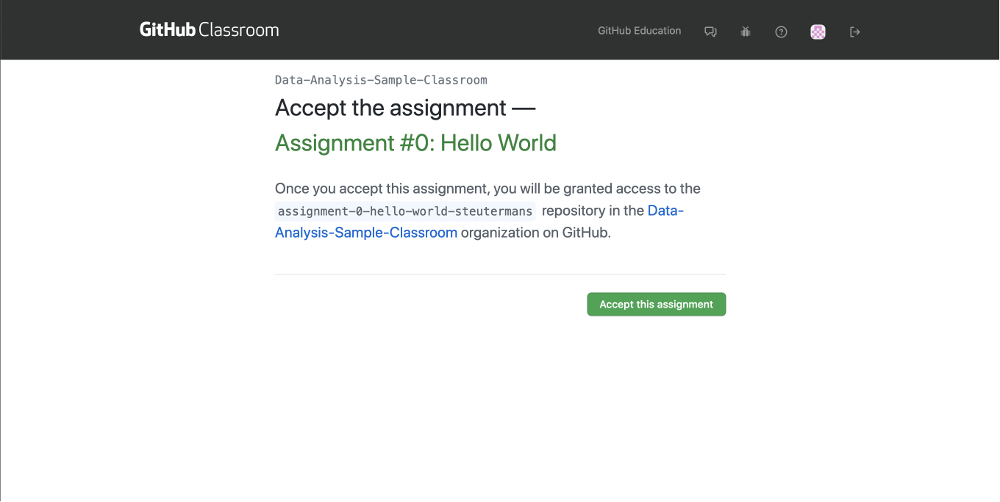

   Clicking on the assignment link in Canvas takes you to this page.

Before you hit the green *Accept the Assignment* button, write down the name of the
assignment repository. In this case, that would be: "assignment-0-hello-world-steutermans".
A **repository** is a Github term for a folder of code.
Having the repository name written somewhere will ensure you can access your assignment code if you 
are interrupted from the rest of the setup process.

Once you have accepted and hit the green button, the next page you will see looks 
something like this:

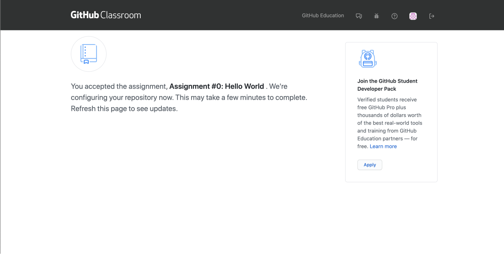

   Most of the time, you only need to wait about 30 seconds to refresh and see the assignment repository.

When you refresh and your assignment repository has been created, this is what you should see:

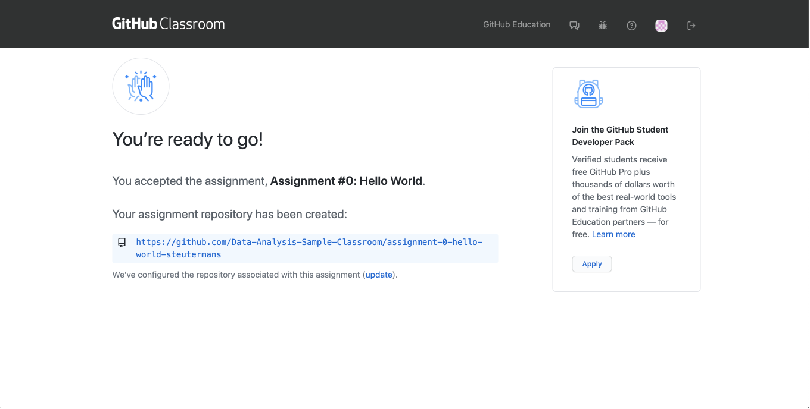

   Your assignment code can now be accessed via GitHub.

If you click on the link on the Github classroom page, you will be redirected to your assignment repository. 
Your assignment repository will look something like this page:

.. figure:: figures/gh-assignment-repository.png
   :alt: Github repository page

The first step to opening up your assignment code and starting your work is to *clone* 
your repository.  In order to do this, click on the button labeled ``Code``.

.. admonition:: Note

   Git is a programming language used by many companies to track changes to projects 
   and share projects between team members as part of a process called **version control**. 
   Github is the biggest online hub for storing code and the workflow of 
   submitting your assignments is all done with Git. 
   Cloning an online repository to your computer is just one of those steps.
   
   While at the beginning of class, Git and Github may seem like just one way for you to 
   save and share your assignment code with course staff, these workflows are going to 
   serve you well for a career in tech.
   Many companies even look at job candidate's Github profiles to see not only their work, 
   but also how often they are working on code!

Once you clicked the ``Code`` button a menu will dropdown.
To clone your repository, you need the HTTPS link for your repository. 
Click on the *Clone* button on the repository page and copy the link!

.. admonition:: Tip!

   If you are not sure if you selected the HTTPS clone code, 
   look at the url you are asked to copy.
   The HTTPS will start with "https:..." 
   If something else is starting the code in the box, try clicking on the HTTPS above the 
   box holding the url.

.. figure:: figures/gh-clone-repo-button.png
   :alt: Highlighting the HTTPS link in the pop-up when the Clone button is clicked.

   After clicking on the green ``Code`` box, the menu dropped down.  
   There is an orange line under the HTTPS indicating that the item to copy is an https link.

To get started coding, open a new window in Visual Studio Code.

.. figure:: figures/vsc-new-window.png
   :alt: An empty code editor window with no projects loaded.

Under the source control tab in the side bar, click *Clone Repository*.

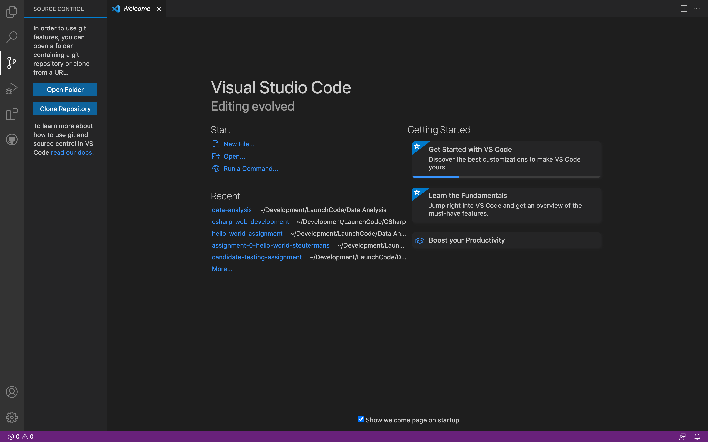

   The source control icon, is a branching line, each end terminated in circle.

When you click on *Clone Repository*, a bar appears at the top where you can paste in the URL you copied from Github.

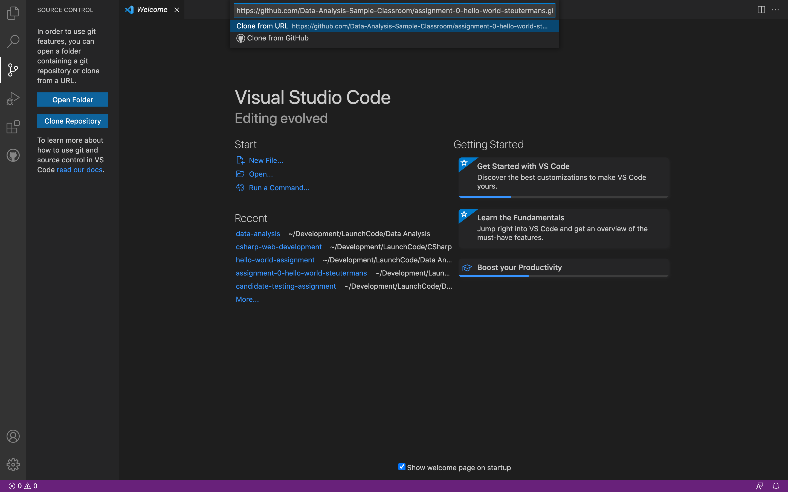

When you do this, you will have to select where you want to clone your project. Make sure you select where your coursework is stored!

.. admonition:: Note

   Thoughout this process, you may have to authorize the connection between Github and Visual Studio Code.

Once the application is loaded, you should see the files in the file tree on the side!

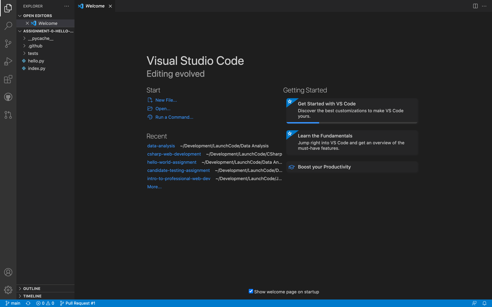

Hello world!
~~~~~~~~~~~~

Once you have loaded the assignment, have a look around the various files and get curious about what this 
code does.
Don't be afraid to look - just don't edit any of this code just yet.

After you have done some exploring, open the *Run and Debug* on the sidebar. 
Run the code in ``index.py``.
If you need a refresher on how to do this, check out the section on :ref:`Testing Your Installation <running-vsc>` to go through running your code in Visual Studio Code step-by-step.

To begin with, the program prints just ``"Hello"``. Remember, your task is to to modify the output of this program so that,
when run, ``"Hello world!"`` is printed. 

Take a look at the ``hello.py`` file. This is the only file in your starter code that needs changing.

.. admonition:: Note

   Depending on where you are at in the reading for this class, you may not have covered functions before.
   You do not need to understand the ins and outs of functions to complete this assignment.
   For now focus on editing the string on the line with the word ``return``.

Inside of ``hello.py``, you should recognize a string on this line: ``return "Hello!"``.

``return`` is another keyword related to functions that we have not yet covered. For now, know that 
``return`` behaves like a surrogate for ``print()``. So anything inside of the string that follows it
will be printed when your application is run.

.. admonition:: Tip

   It's a good idea to take note of how this file in the starter code looks before you start editing.
   Changing any code other than this string may cause your program to not run properly, and therefore may not
   be graded correctly. Making small changes and testing them as you go makes it easier to undo changes you don't want 
   and return to a working state.

With all of this in mind, modify the string on that line so that ``"Hello world!"`` is printed. 

Then run the program again to see your changes! 

Commit Your Changes
~~~~~~~~~~~~~~~~~~~

Now that your program prints ``"Hello world!"``, you'll commit your code. Committing your code is just another part of the version control process.
For now, go to the sidebar in your Visual Studio Code window and click on the source control icon. 

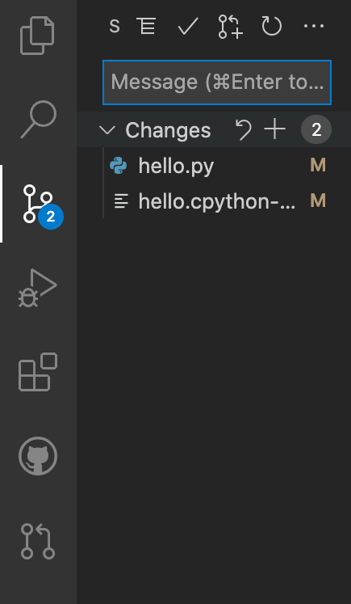

Any files that have been changed are highlighted under *Changes*. Next, we need to stage these files for a commit.
This just means that we want to confirm before moving forward that these files are the ones that we want to commit.
If you changed ``index.py``, you would NOT want to stage that file and instead would want to go back and undo any changes you made.
To stage your changed files for a commit, click on the plus sign next to *Changes* to stage all files or hover over a specific file and click on the plus sign next to the file name to stage just one file.
Files that have been staged will appear under *Staged Changes*:

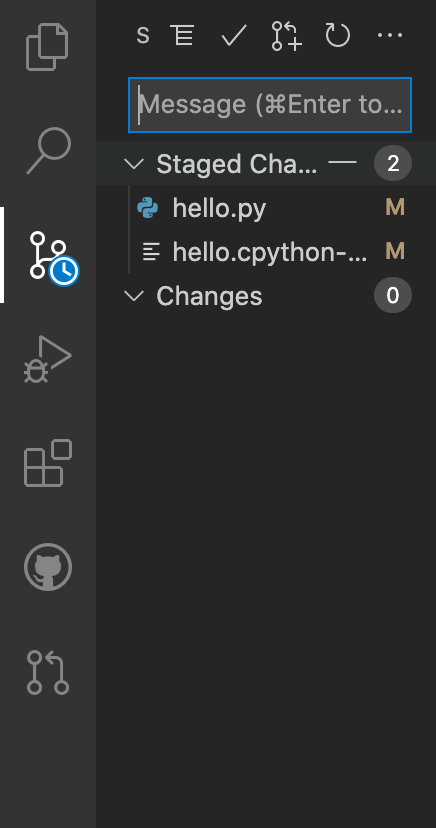

Above the files, write a commit message in the text field that prompts "Message".
A **commit message** is a note about what you have changed in your code.
A good commit message in this case would be something like: "Added my personal solution", or "Updated hello.py
to print 'hello world!'".
When you are satisfied with your message, hit *⌘+Enter* if you are a Mac user or *CTRL+Enter* for Windows users.
After you do so, you will notice that there are no more changes in the sidebar. This is because we have completed making a commit!

.. admonition:: Note

   A commit in Git tracks files changed, the actual changes made within each file, and your note as to what you changed.
   If you ever want to revisit an older version of the file, you simply have to look through the commit history of the repository.

If you went over to look at your repository on Github, you wouldn't see any changes. This is because after we make a commit, we need to *push* that commit to the remote repository on Github.
When you push your code, Github will also run the autograder and update your repo's status as either passing or failing.
Above the box where you entered your commit message, you should see a button with three horizontal dots (ellipsis). Clicking on this button opens a menu with a variety of Git actions.
Select *Push* to send your code to Github. 

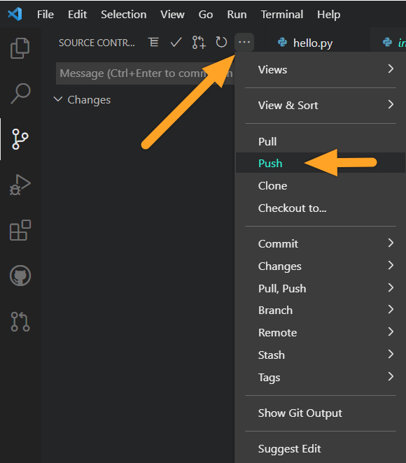

   Once you click on the ellipsis, a dropdown menu appears.  Select push.

Check Your Solution
~~~~~~~~~~~~~~~~~~~

Now that you have committed and pushed your work, head to Github to see that your solution passes the tests.

.. admonition:: Note

   If you left the page open, you may have to reload the page to see your recent commit.

If your solution passes the grading requirements, you will see a green check mark near your latest commit.

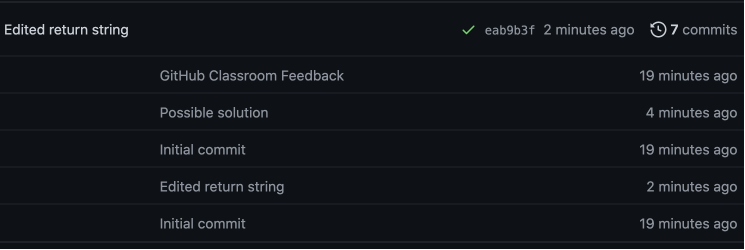

   The latest commit message on this assignment is "Edited return string". The green check to 
   the right of the message indicates that the solution passed.

If your solution does not pass, you will see a red ``x`` in its place.

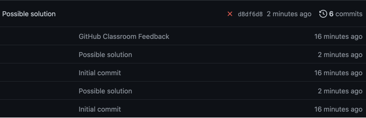

   The latest commit, "Possible solution" does not pass the grading requirements.

A red ``x`` can always be corrected by repeating the previous steps. These are:

#. Return to Visual Studio Code
#. Change the string, 
#. Run the program to visually ensure that ``"Hello world!"`` is printed,
#. Commit and push your changes.

You may make any number of commits to your solution. You won't lose points for committing and pushing many times.
In fact, each assignment is worth only 1 point.
In most cases, you won't need to *commit and push* more than once, however. You can verify that your code runs 
as expected by running it and seeing the proper ``"Hello world!"`` message printed.

In some cases, you may see a yellow dot grading status instead of the green check or red ``x``. This is fine and 
just means that GitHub is currently building your solution. It will often resolve to either a check or ``x`` after 
a few moments.

When you see a green check, your code passes and you are all finished with the assignment. 

.. admonition:: Note

   If your program is outputting "Hello world!", but you are still not seeing a green check mark, make sure you did not edit any file other than ``hello.py``.
   An accidental space or extra character can cause problems with Github Classroom's grading.
   To double check that you have not done so, you can click on the 7-digit code next to the check mark or x.
   This will bring up which files have been changed and any changes made.
   If any other files other than ``hello.py`` were changed, make sure to undo the changes in Visual Studio Code and commit to Github.
