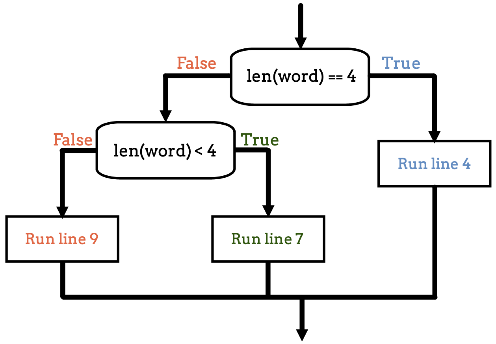

Nested Conditionals
===================

By using an ``if/else`` statement, we produce two branches for our code to
follow. We can add more branches to our program flow by combining conditionals.

Let's see how this works by solving the following problem:

.. admonition:: Example

   Write a program that:

   #. Prompts the user to enter a whole number.
   #. If the number is odd, print nothing.
   #. If the number is even, print "EVEN!" If the number is also positive,
      print "POSITIVE".

Our first attempt at a solution might look like this:

.. sourcecode:: python
   :linenos:

   entry = int(input('Enter a whole number: '))

   if entry%2 == 0:
      print("EVEN!")

   if entry > 0:
      print("POSITIVE")

**Console Output**

::

   Enter a whole number: 7

   POSITIVE

When we enter ``7`` in the prompt, we want the program to print nothing. However,
we see the output ``POSITIVE``. The code doesn't work as we want. Why not?

Written this way, the two conditionals are separate from each other. The result
from one has no influence on the other. Checking ``entry`` as even or odd works
fine on its own. However, the second check gets carried out whether or not
``entry%2 == 0`` is ``True`` or ``False``. :ref:`Remember <if>`, the ``if`` condition
does not apply after the first unindented line. 

.. index::
   single: conditional; nested

We want to check if ``entry`` is positive ONLY IF the number is even. To do
this, we need to put the second conditional *inside* the first. This code
structure is called a **nested conditional**. The result of the first
conditional determines whether or not to consider the second.

.. admonition:: Try It!

   Run this code several times and choose different values for ``entry`` (even,
   odd, positive, negative) to prove that it works as desired. Nice, huh?

   .. replit:: py
      :slug: NestedConditionalsExample01
      :linenos:

      entry = int(input('Enter a whole number: '))

      if entry%2 == 0 :
         print("EVEN!")

      if entry > 0:
         print("POSITIVE")

      # Try removing the indentation for lines 6 & 7 to see how the output changes!

Notice that when we put one conditional inside another, the body of the nested
conditional is indented by two levels rather than one. In Python, the indentation 
of an ``if`` statement determines if it is nested. For an ``if``
statement to run inside another, it must be indented more than the outer conditional. 

Nesting Also Works With ``else``
--------------------------------

In the examples above, we left out the ``else`` clauses from the conditionals.
Let's take nesting a step further by including ``else`` clauses:

.. admonition:: Try It!

   **PREDICT**: What will this program print for the following words?

   #. ``the``
   #. ``kale``
   #. ``rutabaga``

   .. replit:: py
      :slug: NestedConditionalsExample02
      :linenos:

      word = input('Please enter a word: ')

      if len(word) == 4:
         print("What did your mom tell you about using 4-letter words?")
      else:
         if len(word) < 4:
            print("You can think of a longer word than that!")
         else:
            print("Excellent word!")

   Run the program to check your predictions.

.. admonition:: Tip

   In Python, the amount of indentation tells us exactly which ``else`` clause belongs to which ``if`` statement.

This diagram shows the *flow of control* for this program:

Check Your Understanding
------------------------

.. admonition:: Question

   What is printed when the following code runs?

   .. sourcecode:: python
      :linenos:

      num = 7

      if num % 2 == 0:
         if num % 2 == 1:
            print("odd")

   a. The code won't run due to invalid syntax.
   b. odd
   c. even
   d. The code runs but doesn't print anything.

.. Answer = d

.. admonition:: Question

   What is printed when the following code runs?

   .. sourcecode:: python
      :linenos:

      answer_1 = 'yes'
      answer_2 = 'no'
      

      if answer_1 == 'yes':
         if answer_2 == 'yes':
            print("Both of you agree!")
         else:
            print("You two need to work this out.")
      else:
         if answer_2 == 'yes':
            print("Stop arguing and work it out.")
         else:
            print("Clean your bathroom anyway!")

   a. Both of you agree!
   b. You two need to work this out.
   c. Stop arguing and work it out.
   d. Clean your bathroom anyway!

.. Answer = b
