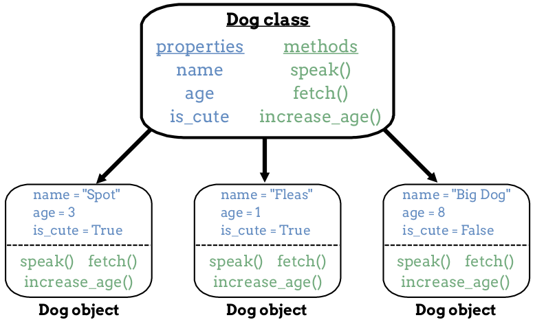

Create a Class
==============

What Classes Do
---------------

We often create many objects of the same type, like a series of whole numbers
or several string values. Classes allow us to do this in an efficient way.

Think of classes like cookie cutters. They provide the structure for making
multiple examples of the same data type, and they make sure each object can
execute the same methods. We reuse a class every time we need to generate a new
object.

.. admonition:: Note

   Although classes create new objects, the objects themselves will NOT be
   exactly the same. For example, all string values have a *length*, but the
   *value* for the length depends on the number of characters in each string.

   Objects of the same type have the same property names and methods. However,
   the values of the properties can differ.

   Think of this like using the same cookie cutter to make sugar cookies vs.
   gingerbread cookies. Each cookie will have *ingredients* and *flavor*
   properties, but these will have completely different values depending on the
   recipe.

Let's revisit the ``dog`` object we used earlier to see how it relates to a
class.

   Classes let us create multiple, similar objects.

Each object contains the same property names, and each one can execute the same
set of methods. The three objects all belong to the same class, even though
their property values differ.

Design a New Class
------------------

Before we create a new class, we should begin by describing the objects that
belong in that class. Take time to think about the properties and methods we
want each object to have. Sometimes it helps to jot them down so you can sort our
overall viability, functionality, usefulness, and any possible redundancies.  
Taking a few minutes to organize your thoughts can help you build better classes.

Another take away from planning out your classes before diving straigth ahead into code, 
is that you can identify the minimal properties and methods needed for basic functionality.
We call this creating a **minimum viable product**, or MVP.  
A `minumum viable product <https://en.wikipedia.org/wiki/Minimum_viable_product>`_ is a working
program or product that is sustained by the smallest codebase possible.

This can be a great place to start.  
When working with MVPs, you are creating a codebase that is easier to debug as you expand it.
This can all help you pare down your code to what is really vital and what can be added or modified later.

.. _brainstorm-properties:

.. admonition:: Try It!

   Let's say we want to create a set of *cat* objects. Take a moment to think
   about the properties the objects should have. We should be able to use these
   properties to describe each cat.
   
   #. The values of the properties will allow us to tell the difference between
      animals, but for now just focus on coming up with a set of property names.
      We are already planning to use ``name`` and ``age``. 
      Think of at least two more property names to add to your class.

   In the *design phase*, we want to include as many property names as we can.
   
   When we start coding, we should keep things simple and build something small
   that works. We won't include all of our ideas right away.
   
   Once we have working code, we can always update it later to make the class
   more powerful.

Now let's convert our thoughts into code.

Define the New Class
--------------------

To define a new class, begin with the ``class`` keyword, followed by the name
of the class. The general syntax is:

.. sourcecode:: python
   :linenos:

   class ClassName:
      # Class code...

Note that class definitions do NOT include parentheses, ``()``.

Just like with variable and function names, Python coders follow a set of rules
and recommendations when defining a new class.

#. Class names begin with a capital letter, followed by lowercase letters.
   For example, ``Cat``.
#. For class names that contain more than one word, begin each new word with a
   capital letter. Do not use underscores to separate the words. For example,
   ``CoolCat``. (FYI: This style is called UpperCamelCase).
#. If the class name contains an abbreviation, use capital letters for that
   abbreviation. For example, ``OSUBuckeyes``.

.. _set-property-values:

Setting Property Values
^^^^^^^^^^^^^^^^^^^^^^^

.. index:: ! initializer method, ! __init__

Each new object contains a set of property values. To assign these values, our
class must include an **initializer method**. This method is defined like any
other function, but it always gets the special name ``__init__`` (two
underscores, then the letters, then two more underscores).

For our ``Cat`` class, this looks like:

.. sourcecode:: python
   :linenos:

   class Cat:
      def __init__(self):
         # Assignment statements based on the properties you designed...

The initializer method automatically runs whenever we call a class, and it
assigns values to each property name.

The ``self`` parameter requires some explanation, and we will use an example to
help set up that discussion.

.. _assign-properties:

.. _define-new-class:

.. admonition:: Try It!

   Use the instructions and editor below to complete the ``__init__`` method:

   .. replit:: python
      :slug: CreatingClasses01-A
      :linenos:

      class Cat:
         def __init__(self):
            # Assign values for the object properties:
            self.name = 'Louis'

   #. To assign a value to a property, the syntax is:

      ::

         self.property_name = property_value

      On line 4, ``self.name = 'Louis'`` assigns the value ``'Louis'`` to the
      property called ``name``.
   #. On line 5, add the statement ``self.age = 2`` to assign the integer ``2``
      to the property called ``age``. Be sure to indent the statement to match
      line 5. This puts ``self.age = 2`` inside the ``init`` code block.
   #. Pick one of the properties you listed :ref:`earlier on this page <brainstorm-properties>`.
      On line 6, assign a value to that property.
   #. Paste the following code on lines 8 and 9. To keep the statements outside
      of the class, do NOT indent them.

      .. sourcecode:: python
         :lineno-start: 8

         cat_1 = Cat()
         print(cat_1.name, cat_1.age)

   #. Line 8 creates a new object called ``cat_1``, and line 9 prints two of
      its properties. Run the program to check your work. Properly done, the
      output should be:

      ::

         Louis 2
      
   #. Modify line 9 to print all three property values.
   #. Finally, create another object called ``cat_2`` and print out its
      property values.

Lets step through the final code:

#. On line 8, ``Cat()`` calls the class to create a new object.
#. Control moves to line 1, and the class statements execute.
#. The ``__init__`` method runs, and it assigns values to each of the
   properties included in the code block. This is where ``self`` plays a role.
#. When we call a class, ``self`` takes on the *name of the new object*. When
   ``cat_1 = Cat()`` executes, ``self`` gets assigned the value ``cat_1``. So:

   - ``self.name = 'Louis'`` evaluates as ``cat_1.name = 'Louis'``
   - ``self.age = 2`` evaluates as ``cat_1.age = 2``
   - etc.

#. After the ``__init__`` method finishes, control passes back to line 8, and
   the new object is assigned to the variable ``cat_1``.
#. In this *Try It* example, the ``__init__`` method causes every new ``Cat``
   object to start with a ``name`` of ``'Louis'``, an ``age`` of ``2``, and the
   third property you defined.

The program creates two cat objects, ``cat_1`` and ``cat_2``, that have the
same property values. Are the two objects the same? To answer this question,
add the statement ``print(cat_1 == cat_2)`` to the bottom of the code and run
the program again. Is the output ``True`` or ``False``?

.. admonition:: Tip

   Think of ``cat_1`` and ``cat_2`` like twins. Even though they have identical
   properties, they still represent *separate animals*. They might look and
   behave exactly the same, but they are different objects!

Use Parameters with ``__init__``
--------------------------------

Once we create ``cat_1`` and ``cat_2``, we can easily change the values for
the ``name`` and ``age`` properties.

.. sourcecode:: python
   
   cat_1.name = "Garfield"

However, it would be better if we could assign these values when the objects
are first created. Instead of giving *every* new ``Cat`` object the same name
and age, we want to let these values vary from object to object.

We do this by adding parameters to the ``__init__`` method:

.. sourcecode:: python
   :linenos:

   class Cat:
      def __init__(self, a_name, an_age):
         self.name = a_name
         self.age = an_age

#. Modify the code in the :ref:`editor above <assign-properties>` to match
   this format. Leave the third property assignment alone for now.
#. Run the program again. The statement ``cat_1 = Cat()`` should now throw an
   error. By adding parameters to ``__init__``, Python expects values to be
   included when we call the class, but we did not provide any.
#. Add arguments for a name and an age in the statement. For example,
   ``cat_1 = Cat('Nala', 4)``. Do the same for ``cat_2``, but use different
   values.
#. Run the program and fix any remaining bugs. Try changing the arguments you
   send to the class when creating a new object. How do those changes affect
   the output?
#. Next, follow a similar process for the third property. Define a parameter
   and include an argument when you call the class.

Check Your Understanding
------------------------

The questions below refer to a class called ``Car``.

.. sourcecode:: python
   :linenos:

   class Car:
      def __init__(make, model, year, color, mpg):
         self.make = make
         self.model = model
         self.year = year
         self.color = color
         self.mpg = mpg

.. admonition:: Question

   If we call the class with ``my_car = Car('Chevy', 'Astro', 1985, 'gray', 20)``,
   what is output by ``print(my_car.model)``?

   a. my_car
   b. Chevy
   c. Astro
   d. 1985

.. Answer = c

.. admonition:: Question

   If we create another object called ``other_car`` with the exact same
   property values, what is the result of the expressions
   ``my_car == other_car`` and ``my_car.year == other_car.year``?

   a. True/True
   b. False/True
   c. True/False
   d. False/False

.. Answer = b

.. admonition:: Question

   What happens if we call the class with ``my_car = Car('Tesla', 'Model S',
   2020, 'blue')``?

   a. The ``mpg`` property is assigned a value of 0.
   b. The ``mpg`` property is assigned the empty string.
   c. The ``mpg`` property is not added to the ``my_car`` object.
   d. The program crashes and displays an error message.

.. Answer = d

