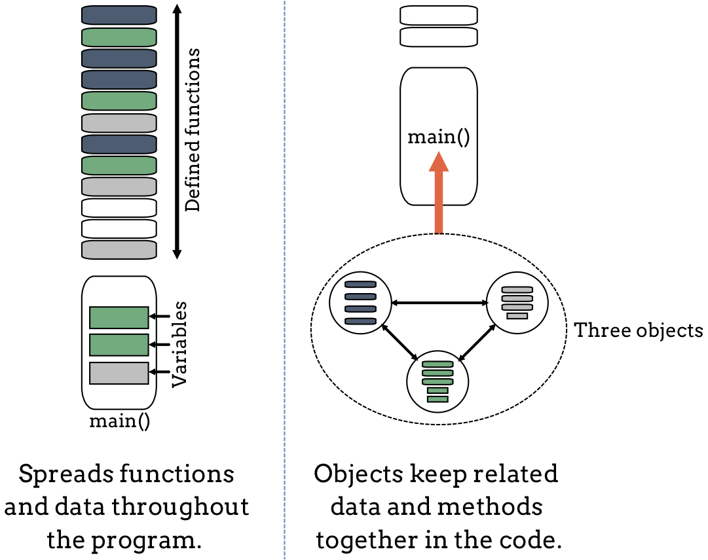
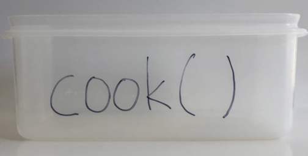
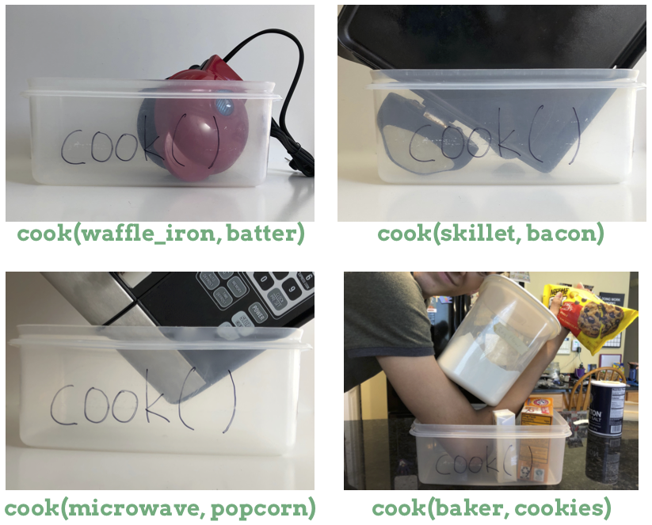
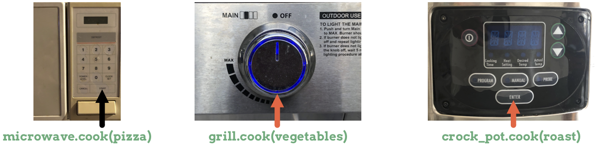

Why Use Objects?
================

.. index:: ! procedural programming

Most of the Python programs you have written so far contain statements that
gather data, do something with it, and then display the results. The statements
follow a general top-down order, and they focus on how to carry out a certain
job. You included functions to help streamline your code, and you called those
functions as you needed them. This style of programming is called
**procedural**. It focuses on the process of working with data:

#. Define or import a function to do a specific job,
#. Call that function and send it some data,
#. Use loops, conditionals, etc. to do something with the returned result.

This style of programming works fine for small programs. However, as our
applications get bigger, reading, debugging and updating the code gets harder.

A Shift in Thinking
-------------------

An *object* wraps the processes of collecting and using data into one tidy
package. A single object can store data, perform actions on that data, and
return the results of those actions. Instead of defining several related
functions and variables at different places in our code, we can collect all of
those statements into a single object.

If we bring together a collection of different objects, each with its own
set of properties and methods, then we can build programs in a much more
flexible way. Each object controls its own data and actions. This lets us break
large programs into smaller chunks of code that are easier to edit and debug.

Imagine that we write a program over several weeks or months. As we build it
and add new features, we code new functions and add them to the end of a
growing list. As long as we include the proper control statements and variables
in ``main()``, our program will work fine. However, as our code grows, it will
get more difficult to keep track of how each function relates to the data and
the actions performed in ``main()``. In the figure below, our program might
look like the image shown on the left (shapes with the same color relate to
each other).

   Objects allow us to keep related code together in a program.

The right hand side of the figure shows the same program. However, this time we
created three objects in ``main()``. Inside each object, we placed data and
actions that relate to each other.

If we test our program and find a logic error with collecting and evaluating
user input, then the object-oriented approach helps us narrow down the
statements we need to check. We can focus on the object that deals with that
task instead of having to search through all of our code to find the faulty
``input`` statements and/or function calls.

Objects are created as they are needed and *only* when the program *runs*.

Objects Copy Real World Thinking
--------------------------------

As we shift our thinking towards using objects, it helps to create a mental
picture that connects how we want to code with some real life examples. In the
world around us, we interact with objects all the time. Think of things like
cars, phones, refrigerators, etc.

Each of these objects has a set of properties that describe it, and each object
can perform different actions. 

Phones as Objects
^^^^^^^^^^^^^^^^^

When we run an app on a smartphone, we use the device to perform a specific
action. This is the same idea behind coding with an object. Instead of writing
a function and sending it some data, we create an object and give it the
ability to perform an action.

Let's think about how using a smartphone relates to coding with an object. Take
a look at the following code:

.. sourcecode:: Python
   :linenos:

   show_weather(phone)

   phone.weather()

Line 1 shows a function call to ``show_weather``, and we pass it ``phone`` as
the argument. The statement tells Python, *Run the code to give us a weather
report, and use the data assigned to phone*. This is an example of procedural
programming.

Line 3 shows an object-oriented approach to the same job. ``phone`` is an
object that contains code for displaying the weather. The statement tells
Python, *Make the phone object run its weather() action*.

Cooking with Objects
^^^^^^^^^^^^^^^^^^^^

If we stand in a kitchen, we will probably find several different tools for
cooking dinner. These might include a microwave, a stove top, an oven, a
crock pot, and maybe a barbecue grill (although we should move that outside
before using it). What we won't find in the kitchen is a device called
``cook()``.

For a moment, lets imagine that we *do* write a ``cook()`` function as part of
our kitchen space. It's not a device, like the stove. Instead, its a place
where we must add items to prepare a meal. Let's think about how we would use
this set of code to do some procedural programming. We can picture the code
block as a box waiting for some input:

   The ``cook()`` function, which represents a spot in your kitchen to deposit food and a device.

When we call the function, we need to send it the *device that does the
cooking* as well as the ingredients.

   ``cook(device, food)``. The function code must deal with multiple tools and ingredients.

Since each device has it's own way of cooking food, the code inside ``cook()``
must be able to handle different tools and ingredients. The function needs to
work for an oven, a toaster, a microwave, etc. This is an inefficient way to
code for the job of cooking.

Now let's look at how we can prepare a meal using the object-oriented approach.

With objects, we can assign a special block of code to each tool. The stove,
microwave, etc. gets its own ``.cook()`` method designed to work with its
hardware. To warm up our food, we put it in a device and then push a button or
turn a dial. Instead of writing one big function to deal with all possible
cooking tools, methods allow us to write smaller blocks of code for each
specific device.

   Each device has its own specific ``.cook()`` method.

The ``.cook()`` method for a microwave contains different code than the
``.cook()`` method for a gas grill.

Writing code for separate ``.cook()`` methods might sound like just as much
work as creating one big ``cook()`` function. Our final program will work well
either way. However, each method represents a smaller individual block of code.
This leaves less room for error and makes debugging much easier. For example,
we can modify the oven code without worrying about how it will affect the crock
pot.

Coding with objects also allows us to more easily expand our program. We can
add a new device and cook method, like ``toaster.cook()``, without needing to
change the code for other objects. The new object and method extends what we
already have. We *add* new code blocks instead of *inserting* the code in the
middle of an existing function. By working this way, we don't disrupt the other
``.cook()`` methods.

Check Your Understanding
------------------------

.. admonition:: Question

   Which of the following refers to the *properties* of an object?

   a. behaviors of the object
   b. actions the object can take
   c. data describing the object
  
.. Answer = c
