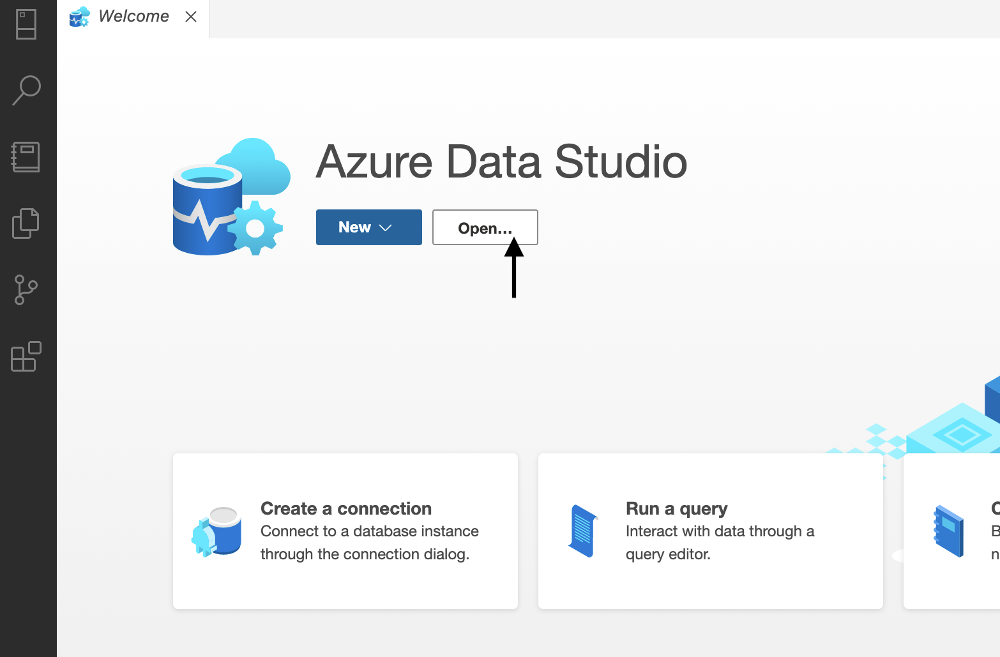

Exercises: Working with Databases in Python
===========================================

Getting Started
---------------

Fork this `GitHub repository <https://github.com/launchcodeeducation/databases-and-py-exercises>`__ and 
clone to your computer. If you need a refresher on how to do this 
see :ref:`Instruction for Using GitHub w/Jupyter Notebooks<usingGitHubNotebooks>`.
 
In Azure Data Studio, click on the open button and navigate to where you saved the git repository you just cloned and open the notebook.  Code along with this `article <https://towardsdatascience.com/do-you-know-python-has-a-built-in-database-d553989c87bd>`__ from Towards Data Science and try out the steps yourself.  

Submitting Your Work
--------------------

When finished make sure to push your changes up to GitHub. Copy the link to your GitHub 
repository and paste it into the submission box in Canvas for **Exercises: Working with Databases in Python** and click *Submit*.
