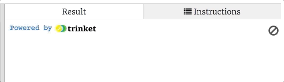

Studio: Mad Dictionaries
=========================

Let's use dictionaries to play Mad-Libs!

.. admonition:: Note

   If you are not familiar with Mad-Libs, you can learn about them
   `here <https://en.wikipedia.org/wiki/Mad_Libs#Format>`__, and then play a
   few `short samples <http://www.madlibs.com/>`__ with your friends.

Fork and clone the starter code from the `remote repository https://github.com/LaunchCodeEducation/dictionaries-studio-data-analysis>`__ 

.. admonition:: Note

   If this process is not working for you, that is okay! While we want you to get the hang of forking and cloning remote repos, we also want you to focus on coding!
   Please use this `repl <https://repl.it/@launchcode/DictionaryStudio>`__ if you need to.

The code runs, but it does not really do anything. Your job is to build three
functions that ask the player questions and complete a Mad-Lib.

.. sourcecode:: python
   :linenos:

   def create_madlib_dict(mlib_string):
      words = mlib_string.split() # Split string into a list of words.
            
      return {} # Return the new dictionary instead of {}.
   
   def prompt_user_for_words(mad_lib_dict):
      answers_dict = mad_lib_dict.copy() # Make an independent copy of the dictionary.
         
      return answers_dict

   def create_output(ml_dict, text):
      new_text = text  # Assign the starting value to new_text.
      
      return new_text
      
   def main():
      mad_lib = ''
      
      mlib_dict = create_madlib_dict(mad_lib)
      user_responses = prompt_user_for_words(mlib_dict)
      output = create_output(user_responses, mad_lib)

   main()

Part 1: Mad-Lib Text
--------------------

First, you need to create a string that looks something like a Mad-Lib
statement.

.. figure:: figures/mad-lib.png
   :alt: A Mad-Lib sentence with two blanks labeled "plural noun" and "adjective".

   Mad-Lib sentence with labeled blanks.

Instead of blanks, you will use symbols to indicate the words a player needs
to provide. For example, if they need to give a verb for the sentence, ``"The
turtle ____ home,"`` your string might look like, ``"The turtle _verb1/ home."``

Note the ``_`` and ``/`` symbols on each side of the label ``verb1``. We will
use this notation to indicate where the player needs to fill in a blank.

#. In the starter code, find the ``main()`` function. Assign the ``mad_lib``
   variable a short Mad-Lib type sentence.
#. Your ``mad_lib`` text should contain two or three blanks where the player
   will need to suggest words. For example:

   ``"My _noun1/ colors are _color1/ and _color2/."``

   Here, the player would be asked to give one noun and two colors to complete
   the sentence.
#. For now, keep the text simple. You can use more complicated Mad-Lib strings
   later.

.. admonition:: Note

   You do not have to use ``_`` and ``/`` around a label, but you should use a
   different symbol on each side. Just choose symbols that are NOT usually used
   in normal text.

   Examples:

   a. ``{noun1}``
   b. ``*noun1_``
   c. ``^noun1|``

Part 2: Build a Dictionary
--------------------------

Once you have your ``mad_lib`` string ready, the next statement in ``main()``
calls the ``create_madlib_dict`` function. The ``mad_lib`` string gets passed
in as the argument.

The ``create_madlib_dict`` function takes the labels from the string and turns
them into keys for a new dictionary. The function then returns that dictionary.

Code the ``create_madlib_dict`` function:

#. Line 1 defines the function and takes a string as a parameter. Line 2 splits
   the ``mlib_string`` into a list of words.
#. On line 3, print ``words`` to see what this list looks like (run the
   program). Note that the ``_`` and ``/`` symbols remain with the words we
   want the player to suggest.

   ::

      ['My', '_noun1/', 'colors', 'are', '_color1/', 'and', '_color2/.']
#. Replace the ``print`` statement with ``new_dict = {}``, to create an empty
   dictionary.
#. Now add a ``for`` loop. It should:

   a. Iterate through the ``words`` list.
   b. Check each word to see if it contains the underscore ``_`` symbol.
   c. If ``True``, take a *slice* from the word and assign it to a variable.
      The slice should NOT include the symbols or any punctuation. 

      .. sourcecode:: python

         key = word[1:word.find('/')] # Returns the characters between _ and /
   d. If ``True``, add a new key/value pair to ``new_dict``. Use ``key`` for
      the key, and use the empty string as the value.
   e. No ``else`` statement is required for the ``if``.

#. Print ``new_dict`` after the loop to check your progress. Properly done,
   it should look something like:

   ::

      {'noun1': '', 'color1': '', 'color2': ''}
#. Remove the ``print`` statement and return ``new_dict`` from the function.
   This gets assigned to the ``mlib_dict`` variable in ``main()``.

Part 3: Query the User
----------------------

OK, now you're ready to ask the player for the fill-in-the-blank words.

The next statement in ``main()`` calls the ``prompt_user_for_words`` function
and sends ``mlib_dict`` as the argument. We want the function to prompt the
player for each of the words needed in the Mad-Lib.

The function should work something like this:

   Prompt the user to fill in the Mad-Lib blanks.

The first line in the ``prompt_user_for_words`` function creates a copy of the
dictionary you built in part 2. You need to add a loop to replace the values in
the collection with player-supplied words.

#. Set up a ``for`` loop to iterate through the keys in ``answers_dict``.
#. Each time the loop repeats, prompt the player to supply one of the missing
   words. Use the key name as part of the prompt. Note that any numbers in the
   key name should NOT be displayed in the prompt, so ``noun1`` shows up as
   just ``noun``.
#. When the player enters a word, update the dictionary to link the current key
   to that word. The word should be all lowercase.
#. Print ``answers_dict`` after the loop to check your progress. Properly done,
   the output should look something like:

   ::

      {'noun1': 'school', 'color1': 'salmon', 'color2': 'brown'}
   
   ``'school', 'salmon'``, and ``'brown'`` were the words entered in the
   console.
#. Remove the ``print`` statement and return ``answers_dict`` from the
   function.

Back in the ``main()`` function, the returned dictionary gets assigned to the
``user_responses`` variable.

Part 4: Print the Result
------------------------

Almost done! Now you just need to complete the Mad-Lib and display it in the
console.

The next statement in ``main()`` calls the ``create_output`` function and sends
it the ``user_responses`` dictionary and the original ``mad_lib`` string. These
get assigned to the ``ml_dict`` and ``text`` parameters in the function.

We want ``create_output`` to build and *return* the final message. The function
will NOT print the message.

.. admonition:: Note

   Yep. It's time to use the accumulator pattern again!

#. Instead of the empty string, the accumulator variable ``new_text`` is
   assigned the original text. This is important, and you will see why soon.
   For now, just roll with it.
#. Code a ``for`` statement to loop through ``ml_dict.items()``. If you need to
   review this idea, look back at the
   :ref:`Loop by Key/Value Pairs <key-value-iteration>` section.
#. Inside the loop, paste the following statements:

   .. sourcecode:: python

      label = '_' + key + '/'
      new_text = new_text.replace(label, value)

   ``key`` and ``value`` are the names of the two loop variables.

#. Next, return ``new_text``, which gets assigned to the ``output`` variable in
   ``main()``.
#. Now check to see if your function produces the expected Mad-Lib. In
   ``main()``, add a ``print`` statement to display the value of ``output`` on
   the screen.

   ::

      Choose a(n) noun:  School
      Choose a(n) color:  salmon
      Choose a(n) color:  BROWN
      My school colors are salmon and brown.

.. admonition:: Tip

   Why ``new_text = text`` instead of ``new_text = ''``? This has to do with
   the ``replace`` statement in the loop.

   #. Try running the program with ``new_text = ''``. What do you notice about
      the output?
   #. Try running the program with ``new_text = text.replace(label, value)``
      inside the loop. What do you notice about the output?
   
   The ``replace`` method creates a new string that swaps one of the labels
   (like ``_noun1/``) with a different word. However, if ``new_text = ''``,
   then the ``replace`` method finds nothing to trade. ``new_text`` never
   becomes anything other than the empty string.

   ``new_text = text.replace(label, value)`` always uses the *unchanged*
   ``text`` string as a starting point, so only the *last* trade gets saved.

   To preserve *all* of the replacements, ``new_text`` needs to start with the
   same labels as ``text``, then get reassigned after each change is made.

Part 5: Try Bigger Mad-Libs
---------------------------

Now that your program runs, it's time to play!

#. Try giving your program a Mad-Lib with more than 2 or 3 blanks to fill.
#. What happens if you use a label with more than one word, like
   ``_plural noun1/``? Is this a *code* issue, or a *label syntax* issue?
#. Ask your teacher to play your Mad-Lib game!

Part 6: Bonus Mission
---------------------

What if a Mad-Lib requires a capitalized word?

``"The _adjective1/ bus dropped us off in the middle of _city1/."``

City names should be capitalized!

Refactor your code to ``.capitalize()`` the player's word whenever the key
name begins with a capital letter.

``"The _adjective1/ bus dropped us off in the middle of _City1/."``

::

   Choose a(n) adjective:  golden
   Choose a(n) City:  phoenix
   The golden bus dropped us off in the middle of Phoenix.
