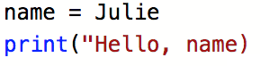
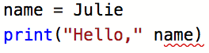
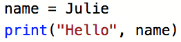

Error Messages are Good
=======================

Syntax and runtime errors *always* produce error messages. Understanding what
error messages mean is an important first step in fixing bugs.

**Error messages are your friends.** This idea might seem strange to new
programmers, because an error message signals that their program is broken.
When we are working with a broken program, we might feel frustrated, or think
that we do not fully understand the concepts.

However, the reality is that *all* programmers, no matter how experienced,
regularly make simple mistakes. If you run your program and it produces an
error message, your first reaction should be, "Great! My program has an error,
but I have a helpful message to help me fix it."

Let's consider a small program with a couple of syntax errors.

.. admonition:: Example

   ::

      name = Julie
      print("Hello, name)

While you might spot the errors just by looking at the code, let's examine the
error messages produced.

.. _syntax-error:

A Syntax Error
--------------

Running the program at this stage results in the message:

::

     File "main.py", line 2
   print("Hello, name)
                     ^
   SyntaxError: EOL while scanning string literal

While some error messages will contain a lot more text than this example, we
only need to really pay attention to a few lines.

#. The message will include the line number where the error was found. In this
   case, line 2.
#. One or more ``^`` symbols will point to character(s) in that line.

   ::

      print("Hello, name)
                        ^

   For many simple syntax errors, we will quickly spot the mistake once Python
   points out its location to us.

#. If knowing the location of the error isn't enough, another line identifies
   the type of error:

   ::

      SyntaxError: EOL while scanning string literal

   This line identifies that actual issue that Python found. It makes it clear
   that we are dealing with a ``SyntaxError``, and it provides a message that
   describes the issue.

If you are scratching your head at the message, "EOL while scanning string
literal," don't worry. Errors often use words and phrases that are not really
clear. However, noticing the words *string literal* and taking a second look at
the previous line helps us make sense of the message.

::

   print("Hello, name)
                     ^

Python is telling us that at the end of ``"Hello, name`` it encountered a
problem with the string. In this case, Python sees the double-quote character
and expects a string. However, we left off the closing ``"``, making the
code invalid.

Fixing this error gives us a program with correct syntax:

.. sourcecode:: Python
   :linenos:

   name = Julie
   print("Hello", name)

.. admonition:: Note

   Error messages may differ depending on where you run your code. The same
   program run in a `repl.it <https://repl.it/>`__ vs. a code editor on your
   computer will generate slightly different error messages. However, these
   differences are minor. The main cause of the error will be reported in the
   same way.

Syntax Errors and Code Highlighting
-----------------------------------

.. index::
   single: syntax; highlighting

Most code editors provide a feature known as **syntax highlighting**. This
means that the editors use different colors to highlight keywords, strings,
numbers, comments, etc. For example, keywords might be blue, strings might be
brown, variables might be white, and numbers green. This useful feature gives
us a quick, visual way to identify syntax errors.

For example, here is a screenshot of our flawed code taken within an
`editor at repl.it <https://repl.it/@launchcode/LCHS-Syntax-Highlighting-Example>`__.

   Screenshot of a program with syntax errors.

Notice that the string ``Hello`` is colored brown, while the symbols ``=`` and
``(`` are colored black. In line 2, however, the comma and final ``)`` are both
brown rather than black. Since we haven't closed the string, the editor assumes
that these two symbols are *part of* the string. Since we expect ``, name)`` to
be black in this editor, the color difference gives us a clue that something is
wrong with our syntax.

Some editors also highlight syntax errors found in the code *before* we click
*Run*. Let's assume we tried to fix the syntax error by putting the closing
quote after ``"Hello,`` instead of ``"Hello``.

         highlights where the editor found a syntax error.

   A red underscore points to a syntax error.

The red wavy line underneath ``name)`` indicates that we still have a syntax
error in our code. Replacing ``("Hello," name)`` with ``("Hello", name)``
causes the red underscore to disappear.

A Runtime Error
---------------

Now that we fixed the syntax error, we can run our program again. Doing so
displays yet another error.

::

   Traceback (most recent call last):
      File "main.py", line 1, in <module>
         name = Julie
   NameError: name 'Julie' is not defined

We have a new error message, this time involving line 1 of our code. We didn't
see this error before because it is a runtime error. The syntax error on line
2, stopped the program during the parsing phase. Even though the current error
involves the line *before* the syntax mistake, the syntax error still gets
reported first.

You might be able to see what the runtime error is, but let's inspect the
message anyway. Doing so will help us understand what Python errors tell us.

Once again, we are told where the error occurs:

::

   name = Julie

There is no ``^`` symbol pointing to a mistake in the line, so let's look at
the next part of the message:

::

   NameError: name 'Julie' is not defined

The type of error is ``NameError``. This occurs when we try to use a variable
that has not been defined earlier in the program.

This information, along with the rest of the message, "name 'Julie' is not
defined," tells us what Python is complaining about. The error message is
saying, *Hey, check your variables!*

In line 1, we forgot to put quotes around the string ``Julie``. *We* know
that we meant to assign the variable ``name`` a string value. However, Python
sees nothing in the program to indicate that ``Julie`` should be a string.
Without the quotes, Python treats ``Julie`` as a variable. Since there is no
such defined variable in our program, a ``NameError`` occurs.

Runtime Errors and Code Highlighting
------------------------------------

Besides syntax errors, code highlighting also helps us spot potential runtime
errors. However, these are harder to spot than syntax mistakes.

         indicates where we forgot to use quotes around a string.

   Black text color indicates missing quotes around a string value.

The ``name`` variable should hold a string value, but the text color for
``Julie`` does not match the text color for ``"Hello"``. The color difference
might catch our eye and make us consider why.

Note that red underscores also point out some (but not all) runtime errors.
However, these will not show up until all of the syntax mistakes are fixed.

.. admonition:: Tip

   Sometimes, hovering the pointer over the red underscore displays useful
   information.

   .. figure:: figures/hover-underscore.png
      :alt: A screenshot with the pointer over a red underscore. Hovering over
            the underscore displays a box with a short error message.

      Try hovering over a red underscore.
