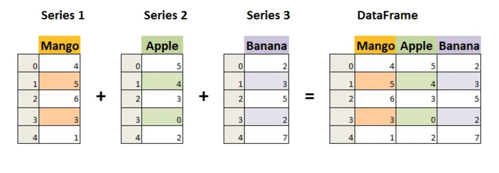

Exploratory Data Analysis
=========================

Read the following articles, follow along where instructed:

.. admonition:: Tip
  
  For Medium articles: if you run out of free articles, open the page in an incognito window.

Exploring Data with Python
--------------------------

Code along with this article.  Stop at Step #8 "Detecting Outliers".

#. `Exploratory data analysis in Python <https://towardsdatascience.com/exploratory-data-analysis-in-python-c9a77dfa39ce>`_.

Get to Know Your Data
---------------------

Read the following articles.

#. `Getting to know your data <https://medium.com/@shanegary/getting-to-know-your-data-9e42935e7f60>`_.

#. `Data Types in Statistics <https://towardsdatascience.com/data-types-in-statistics-347e152e8bee>`_.

Python Pandas
-------------

Code along with this article.  You do not need to install ``pandas``, it comes with ``Anaconda``.  

Stop at "Handling Duplicates".

#. `Python Pandas Tutorial: A Complete Introduction for Beginners <https://www.learndatasci.com/tutorials/python-pandas-tutorial-complete-introduction-for-beginners/>`_

Statistics in Pandas
--------------------

Read the following article.

#. `Basic statistics in pandas DataFrame <https://medium.com/@kasiarachuta/basic-statistics-in-pandas-dataframe-594208074f85>`__.
  
What is a Dataframe?
--------------------

A pandas dataframe is similar to a Python dictionary. The column names are like keys and the values are the data for that column.  This diagram illustrates the different components of a dataframe.

Credit for the above diagram and for more information about Pandas Dataframes `visit here <https://www.w3resource.com/python-exercises/pandas/index-dataframe.php>`__.

| The column values are called a Pandas series. Here is how Pandas series are used to build a dataframe.

Credit for the above diagram and for more information about Pandas Series `visit here <https://www.datasciencemadesimple.com/create-series-in-python-pandas/>`__.

Check Your Understanding
------------------------

.. admonition:: Question

  What is the pandas function used to return the number of rows and columns in a dataframe?

.. admonition:: Question
  
  Column names cannot be changed in dataframes?

  a. True
  b. False

.. admonition:: Question

  What can knowing the data types present in a data set tell us about the data being presented?

.. admonition:: Question

  What is the Pandas method for reading a csv?

.. admonition:: Question

  Visualized below is the “purchases” dataframe . What is the pandas syntax to select for Robert's data?

  .. figure:: figures/purchaseDataframe.png
   :alt: Dataframe showing name of person and if they purchased apples and/or oranges.

.. admonition:: Question

  How do we view only the first 13 rows of a dataframe?

.. admonition:: Question

  A dataframe column is a series?

  a. True
  b. False

.. admonition:: Question  

  Which pandas function will print the number of records, three quartiles, mean, standard deviation, minimum and maximum values of  a dataframe?

  a. .describe() 
  b. .index() 
  c. .statistics() 
  d. .head() 
