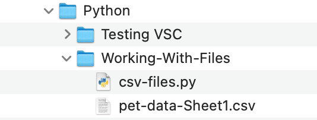

.. TODO: GH code needed

``csv`` Files 
=============

A "Comma Separated Values" file or ``csv`` file is a text file with the values in each row separated by a deliminator.
The most common deliminator is a comma, but can also be a semicolon or other character including a space.  It varies by the file.
Like a spreadsheet, the data is saved in rows.  These rows, or **records**, in ``csv`` files are designated by the start of a new line.  
This type of file is commonly used for table data.  In fact, the data is presented in a format that resembles a table.

``csv`` files are a special text file, which makes them easy to use across a diverse set of applications.
Their simplicity makes them easy to use with data sets and spreadsheets.

.. admonition:: Example

   Four rows from a ``csv`` data set.  Note the commas between each item in the row.

   .. sourcecode:: python

      Name,Species,Age,Size,Adoption Date
      Willow,Dog,6,Large,8/4/2014
      Alyce,Cat,17,Small,12/19/2014
      Thisbe,Cat,12,Large,6/12/2009

Many spreadsheet programs are able to save their data as ``csv`` files.  
This makes them easy to create and share with others.

Working with ``csv`` Files in Python
------------------------------------

Python contains a built-in module ``csv`` to work with this type of file.  
It contains methods that will allow us to open the files, read all of the data at once, or line by line.
It also contains methods that we can use to write new ``csv`` files.

Opening a ``csv`` File in an IDE
^^^^^^^^^^^^^^^^^^^^^^^^^^^^^^^^

.. TODO: Create GH for the files

.. admonition:: Note

   Before we touch any syntax, you will need a file to work with.  
   In this section, we will use this example ``csv`` file.

   **LINK TO GH HERE**

   It is already part of the replit examples.  

Once you have a file, you need to know where it is located.  
In our examples, we are going to keep our files within the same directory as our python program.
This will make it easier to access your files, and will also help keep your files organized.

   Both the python project "csv-files.py" and the ``csv`` file, "pet-data-Sheet1.csv" are in the same directory, "Working-With-Files".

.. admonition:: Note

   Your directories and files may have different names.  Use the following walkthrough as a guide.

   The code blocks below reflect a codebase created in VSC editor.  
   The replit example files will vary some due to the coding environment.

In your IDE, we are going to ``import`` the ``csv`` module and ``open`` our file.  
You can explore the ``csv`` module more `here <https://docs.python.org/3/library/csv.html>`_.

.. sourcecode:: python
   :linenos:

   import csv

   file = "Working-With-Files/pet-data-Sheet1.csv"

   with open(file, "r") as read_obj:

In line 3, we initialize the variable ``file`` with the location to that file.
In this example, we tell the computer that the value of ``file`` is "pet-data-Sheet1.csv", located in the "Working-With-Files" directory.

In line 5, is initalizing a new variable, ``read_obj`` using the keyword ``as``.  
The keyword ``with`` is used to call the ``open`` function in the form of a code block that ends with ``:``.  
We pass our ``file`` and the letter ``r`` to the ``open`` function.  More on ``r`` soon.

..TODO:  using with has a special name -- note it here

.. admonition:: Tip
   
   ``with`` is a keyword often used with files.  
   It closes the files once we come to thethe end of the code block.

   When your code block is closed, you can no longer read or write to it.

Reading the Data
^^^^^^^^^^^^^^^^

Now that you opened your file, let's read it by printing it to console.

.. admonition:: Example

   .. replit:: python
      :slug: Read-csv-Practice
      :linenos:
         
      import csv

      file = "Working-With-Files/pet-data-Sheet1.csv"

      with open(file, "r") as read_obj:
         csv_reader = csv.reader(read_obj)
         
         for row in csv_reader:
            print(row)

   **Console Output**

   ::

      ['Name', 'Species', 'Age', 'Size', 'Adoption Date']
      ['Willow', 'Dog', '6', 'Large', '8/4/2014']
      ['Alyce', 'Cat', '17', 'Small', '12/19/2014']
      ['Thisbe', 'Cat', '12', 'Large', '6/12/2009']
      ['Penny', 'Dog', '4', 'Medium', '8/23/2020']
      ['Jessie', 'Dog', '12', 'Medium', '12/4/2019']
      ['Tiny Bubbles', 'Dog', '2', 'Small', '7/1/2021']
      ['Howser', 'Dog', '5', 'Small', '2/19/2019']
      ['Baby', 'Dog', '3', 'Extra Large', '3/8/2020']  

In line 6, we create another variable to make our code easier to read.  
We call the ``csv.reader()`` function on our ``read_obj``.
The ``csv.reader()`` function returns an object that we can iterate through line by line.
By creating a ``for`` loop in line 8, we to print each row to the console.
Each row returned by this function is a list of strings.

If you only wanted to print data from certain rows, you could modify your ``for`` loop as such:

.. admonition:: Example

   .. sourcecode:: python
      :lineno-start: 8

      for row in csv.reader(read_obj):
         print(row[2], row[3])

   **Console Output**

   ::

      Age Size
      6 Large
      17 Small
      12 Large
      4 Medium
      12 Medium
      2 Small
      5 Small
      3 Extra Large

File Modes
----------

When we opened this file, we opened it like this:

.. sourcecode:: python
   :lineno-start: 5

   with open(file, "r") as read_obj:

Within the ``open`` function, we pass ``file`` and a string ``r``.
The ``r`` opens the file in **read mode**.  
In read mode, we can only work with data already contained within the file.

Other modes include: ``a`` for **append**, ``w`` for **write**, and ``r+`` for **reading and writing**.

Append can be used to add new lines to an existing file or to a new file.

When we write to a file, you need to take care with your files.  
When using ``w`` you will override whatever file you are writing on.
This could cause you to lose your original data unless you create a new file to write to.

Writing Data
^^^^^^^^^^^^

Let's create a new file and move our original data over to the new file.
The syntax is similar when we were reading data except we are passing ``w`` instead of ``r`` to the ``open`` function.

.. admonition:: Example

   .. replit:: python
      :slug: Write-csv-Practice
      :linenos:

      import csv

      file = "pet-data-Sheet1.csv"
      new_file = "new-pet-data.csv"

      with open(file, "w") as read_obj:
         csv_reader = csv.reader(read_obj)
         with open(new_file, "w") as write_obj:
            for line in read_obj:
               write_obj.write(line)  

   **Console Output**

   .. sourcecode:: python

      # in our new file
      ['Name', 'Species', 'Age', 'Size', 'Adoption Date']
      ['Willow', 'Dog', '6', 'Large', '8/4/2014']
      ['Alyce', 'Cat', '17', 'Small', '12/19/2014']
      ['Thisbe', 'Cat', '12', 'Large', '6/12/2009']
      ['Penny', 'Dog', '4', 'Medium', '8/23/2020']
      ['Jessie', 'Dog', '12', 'Medium', '12/4/2019']
      ['Tiny Bubbles', 'Dog', '2', 'Small', '7/1/2021']
      ['Howser', 'Dog', '5', 'Small', '2/19/2019']
      ['Baby', 'Dog', '3', 'Extra Large', '3/8/2020']  

Check Your Understanding
------------------------

.. admonition:: Question

   What is a deliminator in a ``csv`` file?

   a. The end of a line
   b. A comma
   c. ``r`` or ``w``
   d. ``\n``

.. ans: b

.. admonition:: Question

   Which of the following is NOT a mode for the ``open`` function?

   a. ``r``
   b. ``w``
   c. ``r+``
   d. ``wr``

.. ans: d
