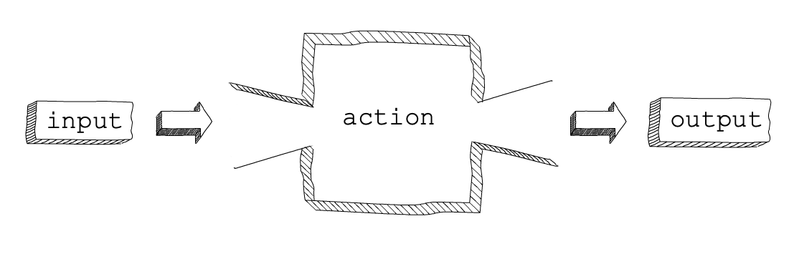

Calling Functions
=================

.. index::
   single: function; machine

.. _function-machine:

One way to picture a function is to think of it as a machine that takes input,
carries out an action, and gives back a result. This is known as the
**function machine** analogy.

   The function machine

If we want to use a function, we must provide it with some input. It carries
out an action on that input and returns a result. The action occurs within the
function, or *inside the machine*. If we know the purpose of a function, we
simply provide it with input and receive the output. The rest is up to the
machine itself.

.. index::
   single: function; call

**Calling a function** is the act of running that function and giving it the
information it needs to do its job.

Making a Function Run
---------------------

The general syntax for calling a function is:

::

   function_name(input values)

You have already become familiar with several Python functions:

- ``print()``
- ``len()``
- Type conversion functions like ``int()``, ``str()``, and ``list()``
- String and list methods, such as ``find()`` or ``reverse()``.

Each function works in the same way. By typing the function's name, followed by
parentheses, we *call* the function. This results in an action being carried
out.

Sometimes, we include values inside the parentheses. When we do this, the
function carries out its action with that data.

.. admonition:: Example

   The *action* of the ``print`` function displays information to the console,
   while the ``max`` function returns the largest value from the given input.

   .. sourcecode:: python

      print("Hello, World!")
      largest_value = max(1, 5, 23, 8)
      print(largest_value)

   **Console Output**

   ::

      Hello, World!
      23

As programmers, we do not need to know *how* Python prints to the console or
figures out the maximum value. Instead, we just need to be able to ask Python
to do those jobs for us with the data we supply.

.. admonition:: Note

   .. index:: ! argument

   Here is an import vocabulary term!
   
   **Arguments** refer to the data values we send to a function. Some functions
   do not require arguments inside the parentheses, ``()``.

If a function requires more than one argument, we separate them with commas:

::

   function_name(argument_1, argument_2, ...)

Try It!
^^^^^^^

Add function calls to the editor below to carry out specific actions.

.. _round-function:

.. admonition:: Example

   The ``sum()`` function adds together all of the numbers stored in a list and
   returns the result. The function takes a single argument---the name of the
   list.

   #. On line 5, define the variable ``total`` and set it equal to the function
      call ``sum(num_list)``.
   #. Print ``total`` to display its value in the console.

   .. index:: ! round()

   The ``round()`` function rounds a value to a specific number of decimal
   places. The function takes two arguments: the original value and the number
   of decimal places desired.

   3. Define the variable ``rounded_result`` and set it equal to the function
      call ``round(quotient, 2)``.
   #. Print both ``quotient`` and ``rounded_result`` to see the result of
      calling the function.

   .. raw:: html

      <iframe height="450px" width="100%" src="https://repl.it/@launchcode/Calling-Functions?lite=true" scrolling="no" frameborder="yes" allowtransparency="true" allowfullscreen="true" sandbox="allow-forms allow-pointer-lock allow-popups allow-same-origin allow-scripts allow-modals"></iframe>

   Play around with the ``max()`` and ``min()`` functions as well!

Why Use Functions?
------------------

Functions are extremely powerful. They allow us to repeat an action without
typing each individual statement every time we want to perform that action.

When we want to send a message to the console using ``print``, we don't have
to know what the console is, or how a string can be displayed on it. The
behavior is wrapped up within the function itself. This packages up the code in
a reusable way, and we do not need to figure out exactly how it works.

Functions allow us to keep our code DRY, a concept that you learned about
:ref:`when we introduced loops <dry-code>`. If we want to do the same basic
task 17 times throughout a program, we reduce code repetition by writing one
function and calling it 17 times.
