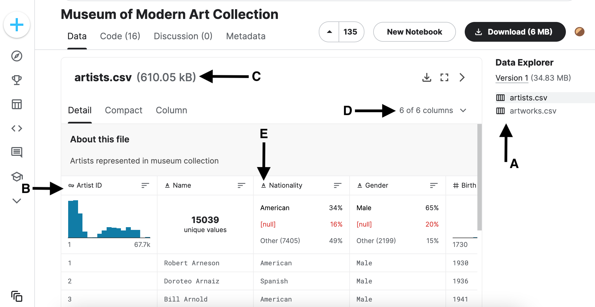

Exercises: Introduction To Data
===============================

Getting Started
---------------

For the exercises, answer the following questions about the lifecycle of a MOMA data 
analysis project. As you work through the exercises, refer to the `Kaggle <https://www.kaggle.com/momanyc/museum-collection>`__ page to get the information you need.

Looking at a dataset on Kaggle:

A. Files
B. Column headings
C. File currently open
D. Selected number of columns from total number of columns displayed.
E. Data type: A = strings # = Number

Create A Document
-----------------

In your chosen word processing program create a document titled: your_name-IntroToDataExercises.  Copy 
the below questions and paste into your document and answer the questions.

.. admonition:: Question

        Business Issue:

        1. MOMA wants their collection to more accurately represent the art of the world. Currently, critics think 
        it is too Eurocentric. MOMA hears this and wants to look at their collection, particularly artists 
        represented, to determine a path forward to changing the feel of the collection. As part of this, MOMA 
        has tasked their team with doing some analyses on the artists of the collection and how the art came to 
        the museum. You are looking into the artwork that came directly from the artist as a gift to the museum 
        and its visitors.

.. admonition:: Question

        Data Understanding:

        1. Given two csvs of artists and artworks, what do the different columns mean to the analysis and what data type is each column?

.. admonition:: Question

        Data Preparation:

        1. We need to merge our two csvs. What columns would you want to keep and what columns do you think are unnecessary? 
 
        2. What information is shared between the CSVs?

.. admonition:: Question

        Exploratory Analysis and Modeling:

        1. What are the key columns that we will be using in our analysis? 

        2. Is there anything that we should be aware of about the data when working on the model?

.. admonition:: Question

        Validation:

        The project found that the top 3 artists to donate their work to the museum are: Louise Bourgeois, William Wegman, and Robert Rauschenberg. 

        1. How would you go about validating this? For example, who at the museum can you speak with to confirm that this information is accurate?

        2. Is there anything in the Credit column that would make you think that you haven't counted a donation properly?

.. admonition:: Question

        Visualization and Presentation:

        You now have to present your findings to the Museums board of directors. 

        1. What do you want to include in the presentation and what do you want to leave out?

Submitting Your Work
--------------------

When finished make sure to save your work. Upload your document into the submission box in Canvas 
for **Exercises: Intro to Data** and click *Submit*.

