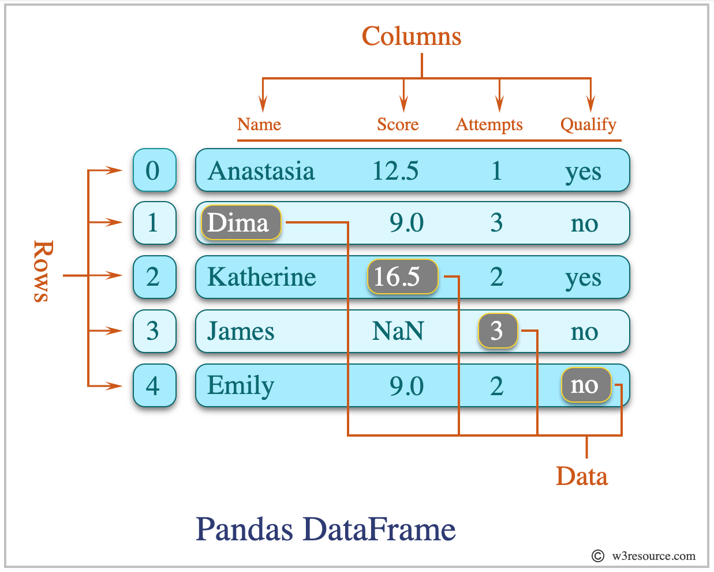

Introduction To Data
====================

Readings
--------

Read the following articles, follow along where instructed:

| `Data Analysis Methods & Techniques <https://www.datapine.com/blog/data-analysis-methods-and-techniques/>`__.

* Key Takeaways: Video about qualitative vs quantitative data illustrates some key points!
  
| `A Beginner's Guide to Data Analysis in Python <https://towardsdatascience.com/a-beginners-guide-to-data-analysis-in-python-188706df5447>`__.

* Key Takeaways: How to take data from the computer and create a visualization using Python.

| `Data project life cycle <https://www.northeastern.edu/graduate/blog/data-analysis-project-lifecycle/>`__.

* Key Takeaways: Definitions of life cycles and Examples.
  
| `Asking the right question <https://www.datapine.com/blog/data-analysis-questions/%C2%A0%C2%A0>`__.

What is a Dataset?
------------------

Think back to when you are working on a monthly budget. Let's say you have a singular spreadsheet 
tracking your monthly automatic payments for May that includes info such as the company name, the 
amount, and the date. Now just this one spreadsheet alone could be a dataset. It would be small and 
you may not be able to gain many insights from just one month of automatic payments, but it is still 
a dataset. If you wanted to gain further insight into your monthly payments, your dataset might 
include every spreadsheet you have of automatic payments for the past year. If you wanted an overview 
of your whole budget, you might add spreadsheets of your taxes, paychecks, and grocery bills to your 
dataset, such as the dataset below.  

What is a Dataframe?
--------------------

A Pandas dataframe is similar to a Python dictionary. The column names are like keys and the values are the data for that column.  This diagram illustrates the different components of a dataframe.

Credit for the above diagram and for more information about Pandas Dataframes `visit here <https://www.w3resource.com/python-exercises/pandas/index-dataframe.php>`__.

| The column values are called a Pandas series. Here is how Pandas series are used to build a dataframe.

.. figure:: figures/diagramPandasSeries.png
   :alt: Diagram of how Pandas series build a dataframe.  

Credit for the above diagram and for more information about Pandas Series `visit here <https://www.datasciencemadesimple.com/create-series-in-python-pandas/>`__.

Check Your Understanding
------------------------

.. admonition:: Question
   
   Name the 5 main types of analysis.

.. admonition:: Question

   What does KPI stand for?

   a. Key Performance Indicators
   b. Key Performance Identifiers
   c. Key Performance Ideas
   d. Key Performance Idioms
	
.. admonition:: Question

   What does EDA stand for?

   a. Exploratory Data Analysis
   b. Explanatory Data Analysis
   c. Exploratory Data Audit
   d. Examinable Data Analysis
	
.. admonition:: Question

   What is between Data Understanding and Exploratory Analysis/Modeling in the project life cycle?

   a. Data Preparation
   b. Validation 
   c. Visualization and Presentation
   d. Business Issue
	
.. admonition:: Question

   If you are a data analyst for a big box store, what is a standard KPI you would want to use to help drive up revenue? (short answer)
   
.. admonition:: Question

   If you are a data analyst for a big box store, where would you get the data that would help answer the question? (short answer)
   
.. admonition:: Question

   If you are a data analyst for a big box store, how do you foresee ensuring data quality? (short answer)