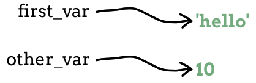
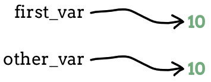
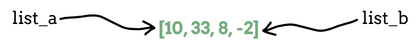

.. _cloning-lists:

Cloning Lists
=============

Every data value that a program uses gets stored in a computer's memory. When
we assign a data value to a variable, that variable becomes a label for the
memory location of that value.

   ``first_var`` points to ``'hello'``, and ``other_var`` points to ``10``.

What if we assign ``first_var`` and ``other_var`` the same value? For
``first_var = 10`` and ``other_var = 10`` each variable points to a different
memory location, even though those locations store the same data.

   ``first_var`` points to ``10``, and ``other_var`` points to a different
   ``10``.

What if we assign one variable to another, like ``other_var = first_var``? Does
``other_var`` point to a new memory location, or does it point to the same
location as ``first_var``?

Let's perform a simple experiment to find out.

.. admonition:: Example

   Examine the output from the following program. How does the value of
   ``other_var`` change when ``first_var`` gets assigned a new value?

   .. sourcecode:: python
      :linenos:

      first_var = 10
      other_var = first_var
      print(first_var, other_var)

      first_var = 'hello'
      print(first_var, other_var)

   **Console Output**

   ::

      10 10
      hello 10

   #. Line 2 assigns the value of ``first_var`` to ``other_var``.
   #. Line 3 confirms that the two variables have the same value.
   #. Line 5 assigns the new value ``'hello'`` to ``first_var``.
   #. Line 6 confirms that changing ``first_var`` does NOT affect ``other_var``.

In this example, even though we set ``other_var = first_var``, each variable
points to a *different* location in memory. This allows us to replace ``10``
with ``'hello'`` for ``first_var`` without changing ``other_var``.

Now let's run the experiment again, but this time we will use a list as the
data type.

.. admonition:: Example

   Examine the output from the following program.

   .. sourcecode:: python
      :linenos:

      list_a = [10, 33, 8, -2]
      list_b = list_a
      print(list_a, list_b)

      list_a.sort()
      print(list_a, list_b)

      list_b.append('hello')
      print(list_a, list_b)

   **Console Output**

   ::

      [10, 33, 8, -2]   [10, 33, 8, -2]
      [-2, 8, 10, 33]   [-2, 8, 10, 33]
      [-2, 8, 10, 33, 'hello']   [-2, 8, 10, 33, 'hello']

The second set of results are quite different from the first. Any changes made
with one variable affect the other!

.. admonition:: Note

   For the ``int``, ``str``, ``bool``, and ``float`` data types, setting
   ``other_var = first_var`` creates separate values in two memory locations,
   one for each variable.
   
   For lists, ``list_b = list_a`` creates two variables that point to the
   *SAME* memory location. The same list has two different names.

.. index:: ! alias

Because the same list has two different names, we say that it is **aliased**.
Changes made with one alias affect the other.

   ``list_a`` and ``list_b`` both point to the same list.

Creating an Independent Copy
----------------------------

What if we want to modify a list but keep the original intact? In general, it
is safer to avoid aliasing when working with lists or other mutable objects.

.. index::
   single: list; cloning

Making a separate copy of a list is called **cloning**, and Python gives us two
ways to do it:

.. sourcecode:: Python

   list_clone = original_list.copy()
   list_clone = original_list[ : ]

The ``copy()`` method creates a new list in a new memory location and assigns
it to the ``list_clone`` variable. The empty slice operator ``[ : ]`` does the
same thing, but it also allows us to clone a portion of the original list.

.. admonition:: Try It!

   Run the following program to confirm that, as written, changes made to
   either ``list_a`` or ``list_b`` affect the other.

   .. raw:: html

      <iframe height="500px" width="100%" src="https://repl.it/@launchcode/LCHS-Cloning-Lists?lite=true" scrolling="no" frameborder="yes" allowtransparency="true" allowfullscreen="true"></iframe>

   #. In line 2, use the ``copy()`` method on ``list_a``. Rerun the program to
      confirm that changes made to one list do NOT affect the other.
   #. Repeat step 1, but use the slice operator instead of ``copy()``.

Check Your Understanding
------------------------

.. admonition:: Question

   The syntax ``list_a = list_b`` creates a(n) ____.

   .. raw:: html

      <ol type="a">
         <li><input type="radio" name="Q1" autocomplete="off" onclick="evaluateMC(name, true)"> alias</li>
         <li><input type="radio" name="Q1" autocomplete="off" onclick="evaluateMC(name, false)"> clone</li>
      </ol>
      

.. Answer = a

.. admonition:: Question

   Changes made to a(n) ____ will NOT affect the original.

   .. raw:: html

      <ol type="a">
         <li><input type="radio" name="Q2" autocomplete="off" onclick="evaluateMC(name, false)"> alias</li>
         <li><input type="radio" name="Q2" autocomplete="off" onclick="evaluateMC(name, true)"> clone</li>
      </ol>
      

.. Answer = b

.. admonition:: Question

   What is printed by the following program?

   .. sourcecode:: Python
      :linenos:

      list_a = [4, 2, 8, 6, 5]
      list_b = list_a
      list_b[3] = 999
      print(list_a)

   .. raw:: html

      <ol type="a">
         <li><input type="radio" name="Q3" autocomplete="off" onclick="evaluateMC(name, false)"> [4, 2, 8, 6, 5]</li>
         <li><input type="radio" name="Q3" autocomplete="off" onclick="evaluateMC(name, true)"> [4, 2, 8, 999, 5]</li>
      </ol>
      

.. Answer = b

.. admonition:: Question

   Describe a specific example or task where we would want to keep the original
   list intact.

   Describe a specific example or task where it would not matter if we used an
   alias or a clone of the original list.

