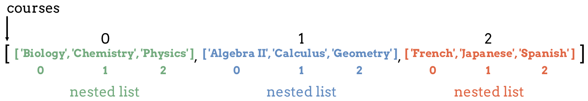

Lists Within Lists
==================

Earlier we learned that lists can store values of any data type. Does this mean
we can store lists inside of lists? Well, yes we can...

.. index:: ! multi-dimensional list, ! nested list

.. index::
   single: list; nested

A **multi-dimensional list** is a list of lists, meaning that the values inside
the list are also lists.

A **nested list** is a list that appears as an element inside another list.
Nested lists can store strings, numbers, and even more lists.

.. sourcecode:: python

   multidim_list = ['a', 'b', [1, 2, 3], 'rutabaga']

In ``multidim_list``, the element at index 2 is a nested list. If we
``print(multidim_list[2])``, we see ``[1, 2, 3]`` appear in the console.

The figure below shows a ``courses`` list that holds lists at each index
position. Each *nested* list contains classes from the same subject area.
Notice that each nested list has its own set of index values.

   Lists within lists.

Two Dimensional Lists
---------------------

The simplest form of a multi-dimensional list is a two dimensional list. Each
element is a nested list, which contains multiple data values.

.. admonition:: Example

   .. sourcecode:: python
      :linenos:

      two_dim_list = [['a', 'b', 'c'], [90, 101], [True, False, False, True]]

      print(len(two_dim_list))

   **Console Output**

   ::

      3

``two_dim_list`` holds three elements, each of which is a list. Note that the
``len()`` function only counts these three elements and NOT the total number of
items inside of the nested lists.

To access the values from a nested list, use two sets of square brackets and
two index values. The indexes evaluate from left to right. The first index
selects one of the nested lists, and the second index selects an element from
that nested list.

.. admonition:: Example

   Use one set of brackets to access a nested list, and add a second set of
   brackets to access the values inside that list.

   .. sourcecode:: python
      :linenos:

      two_dim_list = [['a', 'b', 'c'], [90, 101], [True, False, False, True]]

      print(two_dim_list[0])     # Print the lists at indexes 0, 1, and 2
      print(two_dim_list[1])
      print(two_dim_list[2])

      print(two_dim_list[0][2])  # Print the element from list 0, index 2
      print(two_dim_list[1][1])  # Print the element from list 1, index 1
      print(two_dim_list[2][3])  # Print the element from list 2, index 3

   **Console Output**

   ::

      ['a', 'b', 'c']
      [90, 101]
      [True, False, False, True]

      c
      101
      True

Applying Methods to Nested Lists
--------------------------------

We can apply list methods to either the nested or outer lists. However,
we must use bracket notation carefully.

To apply a method to the outer list, the syntax is:

.. sourcecode:: python

   list_name.method()

To apply a method to one of the nested lists, the syntax is:

.. sourcecode:: python

   list_name[index_of_nested_list].method()

.. admonition:: Example

   Examine how including bracket notation affects how the ``reverse`` method
   changes each list.

   .. sourcecode:: python
      :linenos:

      list_a = [ ['a', 'b', 'c'], ['A', 'b', 'c'], ['A', 'B', 'C'] ]
      list_b = [ ['a', 'b', 'c'], ['A', 'b', 'c'], ['A', 'B', 'C'] ]

      list_a.reverse()     # Change the order of the 3 nested lists, but NOT their elements.
      list_b[2].reverse()  # Change the order of the list at index 2.

      print(list_a, '\n', list_b)

   **Console Output**

   ::

      [ ['A', 'B', 'C'], ['A', 'b', 'c'], ['a', 'b', 'c'] ] 
      [ ['a', 'b', 'c'], ['A', 'b', 'c'], ['C', 'B', 'A'] ]

Try It!
^^^^^^^

In the editor below, do the following:

#. Append ``new_nums`` to ``id_number_lists``, and append the value ``444`` to
   the first list in ``id_number_lists``.
#. Print ``id_number_lists`` to verify your changes. Also, print the length of
   ``id_number_lists`` (which should be ``4``).
#. Print a slice of the last two elements in ``id_number_lists``. Also, print a
   slice of the first two elements from the third list in ``id_number_lists``.
#. Sample output:

   ::

      [ [111, 222, 333, 444], [987, 654], [1010, 1100, 0, 1], [1138, 42, 5] ] 
      4
      [ [1010, 1100, 0, 1], [1138, 42, 5] ]
      [1010, 1100]

#. When done with steps 1 - 4, paste these statements to the bottom of your
   code. Run the program and examine the output. Write down your explanation of
   what happens at each step in the loops.

   .. sourcecode:: python
      :lineno-start: 12

      for id_numbers in id_number_lists:
         print('Outer loop:', id_numbers)

         for number in id_numbers:
            print('Nested loop:', number)

         print('--------------')

.. raw:: html

   <iframe height="550px" width="100%" src="https://repl.it/@launchcode/LCHS-Multi-dimensional-Lists?lite=true" scrolling="no" frameborder="yes" allowtransparency="true" allowfullscreen="true"></iframe>

Beyond Two Dimensional lists
-----------------------------

There is no limit to how many layers we can have inside our lists. However, it
is rare to use more than two dimensions.

Check Your Understanding
------------------------

Use the following list to answer the questions:

.. sourcecode:: python
   :linenos:

   data = [
      ["science", "computer", "art"],
      ["Jones", "Diaz", "Rhodes"]
   ]

.. admonition:: Question

   Which of the following will access the name ``"Jones"``?

   .. raw:: html

      <ol type="a">
         <li><input type="radio" name="Q1" autocomplete="off" onclick="evaluateMC(name, false)"> data[0][0]</li>
         <li><input type="radio" name="Q1" autocomplete="off" onclick="evaluateMC(name, false)"> data[0][1]</li>
         <li><input type="radio" name="Q1" autocomplete="off" onclick="evaluateMC(name, true)"> data[1][0]</li>
         <li><input type="radio" name="Q1" autocomplete="off" onclick="evaluateMC(name, false)"> data[1][1]</li>
      </ol>
      

.. Answer = c

.. admonition:: Question

   How would you add ``"dance"`` to the first nested list?

   .. raw:: html

      <ol type="a">
         <li><input type="radio" name="Q2" autocomplete="off" onclick="evaluateMC(name, false)"> data.append('dance')</li>
         <li><input type="radio" name="Q2" autocomplete="off" onclick="evaluateMC(name, true)"> data[0].append('dance')</li>
         <li><input type="radio" name="Q2" autocomplete="off" onclick="evaluateMC(name, false)"> data[1].append('dance')</li>
      </ol>
      

.. Answer = b

