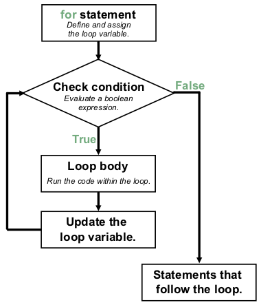

``for`` Loops
=============

.. index::
   single: loop; for
   single: iteration; definite

.. index:: ! for loop

The ``for`` loop is the first Python tool for iteration that we will explore. A **for loop** is typically used for **definite iteration**. Definite iteration is the process of repeating a specific task with a specific data set. When a ``for`` loop begins it can usually be determined exactly how many times it will execute: once for each item in the data set.

``for`` Loop Syntax
-------------------

.. index::
   single: for loop; syntax

We have already seen the basic syntax of a ``for`` loop.

.. sourcecode:: python
   :linenos:

   for num in range(51):
      print(num)

   print("Done!")

This program prints the integers 0 through 50, one number per line. In the language of definite iteration, we say that the loop has a data set of 0-50, and its action is to print a value to the console.

Let's break down this syntax piece by piece, so we can begin to understand how ``for`` loops are structured.

.. index::
   single: for loop; variable

#. In line 1, ``num`` is called the **loop variable**. Each time the loop
   executes, ``num`` gets assigned a new value.
#. Line 2 begins the loop body. The loop body is ALWAYS indented. The
   indentation determines exactly what statements are “in the loop”. 
#. The *first* unindented line after the ``for`` statement marks the end of the
   loop body.  In this example, line 4 is not part of the loop.
#. The loop body can contain any number of statements.
#. The number of times the loop body runs depends on the value in ``range()``.

Line By Line
^^^^^^^^^^^^

Let's modify the code just a little to follow the operation of a ``for`` loop.

.. admonition:: Example

   .. sourcecode:: Python
      :linenos:

      for num in range(4):
         print(num)
         print("Hello" * num)

      print("Done!")

   **Console Output**

   ::

      0

      1
      Hello
      2
      HelloHello
      3
      HelloHelloHello
      Done!

#. The first time Python executes the ``for`` statement in line 1, ``num`` is
   assigned a value of ``0``.
#. Next, Python checks if the value of ``num`` is less than the value inside
   ``range``. Since ``num < 4`` evaluates to ``True``, the loop body executes.
#. Line 2 prints the current value of ``num``.
#. Line 3 prints the string ``Hello`` zero times.
#. Python reaches the end of the loop body (the indented lines). At this point,
   it increases the value of ``num`` by 1 and then MOVES BACK TO THE ``for``
   STATEMENT (line 1).
#. The new value of ``num`` (``1``) gets compared to the ``range`` value.
   Since ``num < 4`` still returns ``True``, the loop body executes again.
#. Lines 2 and 3 run with the new value of ``num``, so we see ``1`` and
   ``Hello`` printed to the console.
#. Python again reaches the end of the loop body, increases the value of
   ``num`` and moves back up to the ``for`` statement.
#. This process continues until the value of ``num`` reaches the end of the
   specified ``range``. Once the comparison ``num < 4`` returns ``False``, the
   loop ends. Since Python adds 1 after each iteration, this occurs when
   ``num`` is 4 (so ``4 < 4`` is ``False``). At that point, the loop body will
   have run exactly 4 times, with ``num`` taking the values 0, 1, 2, and 3.
#. Once the loop finishes, Python proceeds to line 5 and prints ``Done!`` one
   time.

We can use a picture to show the *flow of execution* of this ``for`` loop:

.. _for-loop-control-flow:

   Flow of execution of a ``for`` loop

Notice that even though line 1 uses ``range(4)``, the value ``4`` is NOT
included in the output. Why?

Begin Counting at 0
^^^^^^^^^^^^^^^^^^^

.. index:: ! zero-based indexing

Iterating a certain number of times is a very common thing to do, and Python
gives us the built-in ``range`` keyword to provide a set of values for the loop
variable to use.

The sequence provided by ``range`` always starts with ``0``. If you ask for
``range(4)``, then you will get 4 values starting with 0. In other words, 0, 1,
2, and finally 3. Notice that 4 is not included since we started with 0.
Likewise, ``range(10)`` provides 10 values, 0 through 9. Starting a count at 0
instead of at 1 is called **zero-based indexing** and is very common in
computer programming.

.. admonition:: Note

   Programmers like to count from 0!

   For ``range(n)``, the loop variable will take each integer value from 0 up
   to BUT NOT INCLUDING ``n``.

Check Your Understanding
------------------------

.. admonition:: Question

   How does Python know what lines are contained in the loop body?

   a. The lines are indented by the same amount from the ``for`` statement.
   b. There is always exactly one line in the loop body.
   c. The loop body ends with an empty line.
   d. The loop body ends at the next ``for`` statement.

.. Answer = a.

.. admonition:: Question

   How many lines does the following code print?

   .. sourcecode:: python
      :linenos:

      for number in range(10):
         print("I have", 12 - number, "cookies. I'm going to eat one!")
   
   a. 1
   b. 9
   c. 10
   d. 12

.. Answer = c.

.. admonition:: Question

   For the code above, what is the value of ``number`` the *third* time Python
   executes the loop?
   
   a. 1
   b. 2
   c. 3
   d. 4

.. Answer = b.

.. admonition:: Question

   For the same code, what is the LAST line printed by the program?
   
   a. ``I have 2 cookies. I'm going to eat one!``
   b. ``I have 3 cookies. I'm going to eat one!``
   c. ``I have 10 cookies. I'm going to eat one!``
   d. ``I have 12 cookies. I'm going to eat one!``
   
.. Answer = b.
