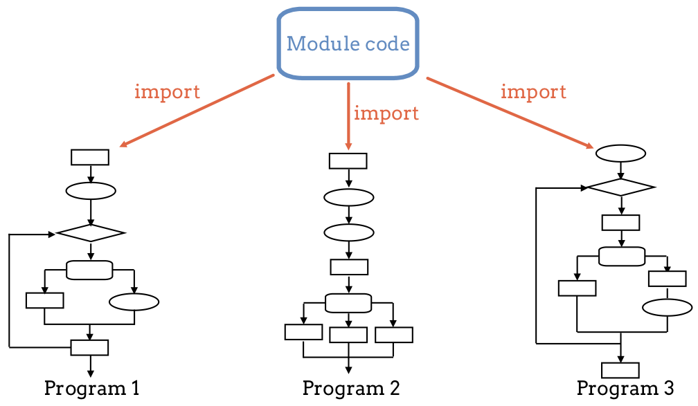
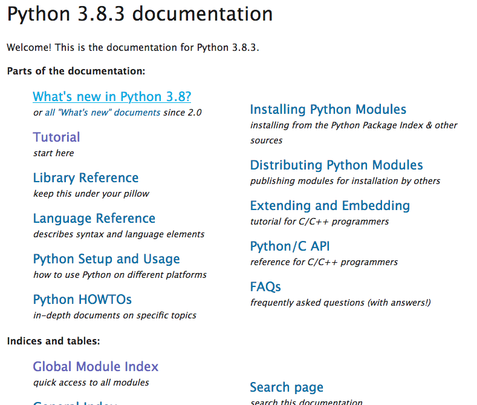
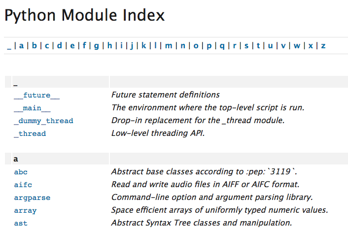

What are Modules?
=================

In the last chapter, we learned that functions allow us to reuse the same block
of code many times throughout a program. Once we create a useful function, we
might find a use for it in other programs as well. We could easily copy and
paste that function into new projects, but this leads to a couple of problems:

#. Copy/pasting code does NOT keep our work DRY (Don't Repeat Yourself),
#. If we make an update to the function, we need to apply that update to ALL
   copies of the function. If the function is super-useful, we probably put it
   into lots of projects. Tracking down and changing every single one would
   take lots of time, and we would likely miss a few.

Fortunately, we have a way to share functions and other useful tools across
different programs WITHOUT copy/paste.

.. index:: ! module

A **module** is a file containing Python values, functions, etc. that can be
used in other Python programs. Instead of pasting a new copy of a function into
every new project, we store the original in a file and then *import* that file
when we need it. Changing the code in the module affects all of the programs
that imported it. This makes applying updates much more efficient.

   The same module code can be imported and used by completely different programs.

.. admonition:: Note

   Modules are NOT designed to run on their own. Their purpose is to *support*
   many different programs by storing the code for commonly used functions,
   values, tools, and tasks.

Why Use Modules?
----------------

There are many modules that come with Python as part of the standard library.
These offer us lots of ready-made tools that we can use to speed up the time it
takes us to build our own projects.

We can also create our own modules to store data, functions, and tools that we
have built on our own and want to use again later.

Even better, we can SHARE our modules with other programmers, or combine
someone else's work (with permission) to our own. Instead of writing every
single part of a new project from scratch, another coder might have already
written some of the code we need. If that person makes their work available, we
can immediately import their modules into our own project---saving us time and
effort.

   Modules keep us from reinventing the wheel.

We do not need to worry about HOW a module works. We just need to be able to
pull it into a project and use its functions.

Finally, modules allow us to keep different parts of our program in separate,
smaller pieces. We code these smaller chunks and then connect the modules
together to create the big project. Just like keeping functions small and
simple helps with debugging, splitting up a large project into smaller pieces
makes it easier to fix. We can also add more modules to the project to quickly
give the whole program new abilities.

A List of Python Modules
------------------------

Python comes with LOTS of modules, and we have already used one of these quite
a bit---the ``turtle`` module. Once we *import* the module, we gain access to
everything it contains.

.. admonition:: Example

   .. sourcecode:: Python
      :linenos:

      import turtle           # Allows us to use the turtle module

      bob = turtle.Turtle()   # Create a turtle named bob

      bob.forward(150)        # Move bob forward 150 pixels
      bob.left(90)            # Turn bob left by 90 degrees
      bob.circle(75)          # Draw a circle with a radius of 75 pixels

In this example, we use several tools defined in the module---``Turtle()``,
``forward()``, ``left()``, and ``circle()``.

What if no one told us about ``turtle``? How would we know it exists? How
would we know what it can do for us?

The `Python Documentation <https://docs.python.org/3/>`__ site is an extremely
useful source of information. The site includes a list of all the standard
modules that come with Python (called the
`Global Module Index <https://docs.python.org/3/py-modindex.html>`__).

The Global Module Index gives an alphabetical listing of all the modules that
are available as part of the standard library.

Clicking on the ``turtle`` option opens a page that describes all of the
tools the module contains.

.. figure:: figures/turtle-graphics-page.png
   :alt: The webpage that describes the Python turtle module. 
   :width: 50%

.. admonition:: Note

   For now, do not worry about wading through all of the possible modules. In
   this book, we point out the most useful ones for beginning Python coders.

   As your skills grow, you can explore other options on your own.

Check Your Understanding
------------------------

.. admonition:: Question

   In Python a module is:

   .. raw:: html

      <ol type="a">
         <li><input type="radio" name="Q1" autocomplete="off" onclick="evaluateMC(name, true)"> A file containing Python code for use in other Python programs.</li>
         <li><input type="radio" name="Q1" autocomplete="off" onclick="evaluateMC(name, false)"> A separate block of code within a program.</li>
         <li><input type="radio" name="Q1" autocomplete="off" onclick="evaluateMC(name, false)"> One line of code in a program.</li>
         <li><input type="radio" name="Q1" autocomplete="off" onclick="evaluateMC(name, false)"> A file that contains information about functions in Python.</li>
      </ol>
      

.. Answer = a

