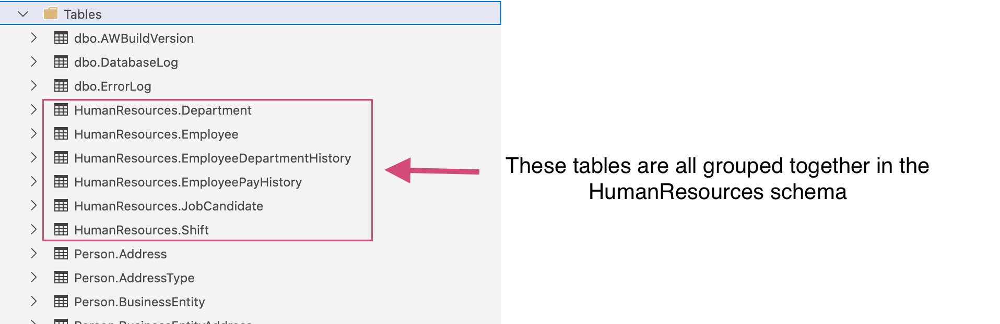

SQL Part 5 - Schemas and CRUD Operations
========================================

In order to give you more advanced SQL practice, a schema has been created for each of you for the exercises and studio for this lesson. 
Consider it your own personal sandbox, as you are the only one who has access to it.

A **schema** is a way to group database objects(tables, views, ect) into a logical collection. 
Let's look at the ``AdventureWorks2019`` database in Azure Data Studio. 

In the Object Explorer if you expand the tables you will see something like this:

Notice how the tables are grouped together. The syntax is ``schema_name.table_name``. 
You wouldn't want someone accidentally deleting a table or being able to view sensitive information. 
Schemas allow companies to easily control who has access to specific tables and how they have access.

Another way to think of schemas is that they are like using folders on your google drive. 
You can group together like-documents and control who has access by granting different permissions to different people. 
At any time you can also change permissions or remove someone from having access. You can also move documents from one folder to another. 
Multiple people can work together in each folder. The creator of the folder or document is the owner. 
But, you can easily reassign the ownership to another person. The same is true of Schemas.

For more information about schemes visit `here <https://www.c-sharpcorner.com/UploadFile/ff2f08/schema-in-sql-server/>`__.

How To Create Tables
--------------------

#. `From Scratch <https://www.sqlservertutorial.net/sql-server-basics/sql-server-create-table>`__.
#. `From Other Tables <https://www.techonthenet.com/sql/tables/create_table2.php>`__.

More on primary keys
--------------------

#. `SQL Server PRIMARY KEY <https://www.sqlservertutorial.net/sql-server-basics/sql-server-primary-key/>`__.

Temp Tables
-----------

Are often used when you may not have certain permissions on a database but need to run queries in your everyday work. 
Only you can see the **temp table** you create in the connection you created it in. 
You can not access the temp table from another workspace/window/notebook. 
When you close the connection the table has been created in, it's automatically deleted.
While the article below mentions Global Temp Tables they are almost never used.

#. `Introduction to Temporary Tables in SQL Server <https://codingsight.com/introduction-to-temporary-tables-in-sql-server/>`__.

Adding Records
--------------

#. `SQL INSERT INTO Statement <https://www.w3schools.com/sql/sql_insert.asp>`__.

Updating Existing Records
-------------------------

#. `SQL UPDATE <https://www.sqltutorial.org/sql-update/>`__.

Deleting Records
----------------

#. `SQL DELETE <https://www.zentut.com/sql-tutorial/sql-delete/>`__.

Deleting Tables
---------------

#. `SQL DROP TABLE Statement <https://www.w3schools.com/sql/sql_drop_table.asp>`__.

**Additional Resources (Optional Reading)**

#. `You Are Not My Data Type: A quick intro into SQL data types <https://towardsdatascience.com/you-are-not-my-data-type-3ba3d3dec258>`__.
#. `SQL Server Data Types <https://www.sqlservertutorial.net/sql-server-basics/sql-server-data-types/>`__.

Check Your Understanding
------------------------

.. admonition:: Question

   Which of the following queries would you use to create a table called recipes, that holds name(up to 25 characters), description(up to 50 characters) and instructions (up to 500 characters).

   .. code-block:: sql

      1. CREATE TABLE schema_name.recipes(
            name VARCHAR(25),      
            description VARCHAR(50),      
            instructions VARCHAR(500),
         );

      2. MAKE TABLE schema_name.recipes(
            name VARCHAR(25), 
            description VARCHAR(50), 
            instructions VARCHAR(500),
         );
         
      3. CREATE TABLE schema_name.recipes(
            name,
            description,
            instructions,
         );

      4. CREATE TABLE schema_name.recipes(
            name (25),
            description (50),
            instructions (500),
         );

.. admonition:: Question

   Which of the following queries would you use to create a new table called ``new_HR``, from the ``HumanResources.Department`` table in the ``AdventureWorks2019`` Database?

   .. code-block:: sql

      1. CREATE TABLE new_HR
            AS(SELECT * FROM AdventureWorks2019.HumanResources.Department);
      
      2. CREATE TABLE new_HR
         FROM AdventureWorks2019.HumanResources.Department;
      
      3. MAKE TABLE new_HR
            AS(SELECT * FROM AdventureWorks2019.HumanResources.Department);
      
      4. MAKE TABLE new_HR
         FROM AdventureWorks2019.HumanResources.Department

.. admonition:: Question

   Write a query that creates a table called ``HRemployees`` from the ``HumanResources.Employee`` in the ``AdventureWorks2019`` database that only includes the following columns(``LoginID``, ``JobTitle``, ``VacationHours``) and only includes records from employees with more than 80hrs of vacation.

.. admonition:: Question

   What is a **primary key**?

.. admonition:: Question

   Can you add a **primary key** to an existing table? 

   a. True 
   b. False

.. admonition:: Question

   How does the syntax differ when you create a temp table?

.. admonition:: Question

   Which of the following queries would add information into the ``Recipes`` table below.

   .. figure:: figures/recipesTables1.png
      :alt: Recipes table with one row.

   .. code-block:: sql
   
      1. INSERT INTO schema_name.Recipes (name, description, instructions)
         VALUES('Pizza', 'To lazy to cook but hungry', 'Call ModPizza and order for delivery');
  
      2. ADD ROW schema_name.Recipes (name, description, instructions)
         VALUES('Pizza', 'To lazy to cook but hungry', 'Call ModPizza and order for delivery');

      3. INSERT INTO schema_name.Recipes (2, name, description, instructions)
         VALUES('Pizza', 'To lazy to cook but hungry', 'Call ModPizza and order for delivery')

      4. ADD ROW schema_name.Recipes (2, name, description, instructions)
         VALUES('Pizza', 'To lazy to cook but hungry', 'Call ModPizza and order for delivery')

.. admonition:: Question

   Write a query to update the second recipe's ``Instructions`` to call Dominos instead in the ``Recipes`` table below.

   .. figure:: figures/recipesTable2.png
      :alt: Recipes table with three rows.

.. admonition:: Question

   | Write a query to delete any records with a ``Description`` of Frozen from the ``Recipes`` table below.

   .. figure:: figures/recipesTable3.png
      :alt: Recipes table with four rows.

.. admonition:: Question

   Write a query to clear all the contents of the ``Recipes`` table.

.. admonition:: Question

   Which of the following queries will delete the entire ``Recipes`` table?

   .. code-block:: sql

      1. DROP TABLE schema_name.Recipes;

      2. REMOVE TABLE schema_name.Recipes;

      3. FROM schema_name
         DROP TABLE Recipes;

      4. DELETE TABLE schema_name.Recipes;

