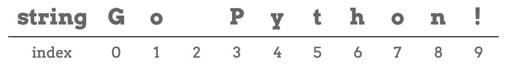
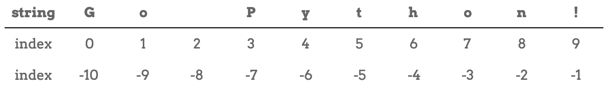

Bracket Notation
================

.. index:: 
   single: string; index

.. index:: ! index

Strings are *ordered* collections of characters, and this gives us a nice
mental model for how they are put together. Each character has its own specific
location within a string. We call this location the **index**.

Consider the string ``'Go Python!'`` The first character, ``'G'``, has an index
value of 0, the first ``'o'`` has index 1, the space ``' '`` has index 2, and
so on. Index values are integers representing the position of a character
within a given string.

   The index values of a string.

.. index:: zero-based indexing

Note that this is another example of *zero-based indexing*. The count begins
with the value 0.

Access One Character
--------------------

.. index:: ! bracket notation

**Bracket notation** is the special syntax that allows us to access the single
characters that make up a string. To access a character, we use the syntax:

.. sourcecode:: Python

   some_string[index]

where ``index`` is the position of the character we want.

The expression ``'school'[2]`` selects the character at index ``2`` and creates
a new string containing just that one character.

With zero-based indexing, the letter at index 0 of ``'school'`` is ``'s'``. So
at position [2] we have the letter ``'h'``.

.. _string-index-try-it:

.. admonition:: Try It!

   Predict which letters will be printed to the console. Check your answers by
   clicking *Run*. Remember that with zero-based indexing, the *first*
   character always has an index value of ``0``.

   .. raw:: html

      <iframe height="400px" width="100%" src="https://repl.it/@launchcode/LCHS-Bracket-Practice-Strings?lite=true" scrolling="no" frameborder="yes" allowtransparency="true"></iframe>

   Now try the following:

   #. Change the index values in lines 3 and 5 to see how they affect the
      output.
   #. Enter ``40`` into the brackets in line 3. What happens when you use an
      index value that is larger than the length of the string?
   #. Replace ``40`` inside the brackets with a negative number, like ``-1``.
      What happens?

In step 2 above, ``this_string[40]`` causes an *index out of range* error.
This happens anytime we try to reference an index location that does not exist
in the string. 

We will discuss what a negative index value returns in step 3 shortly. 

Expressions for ``index``
^^^^^^^^^^^^^^^^^^^^^^^^^

If we want to access the *last* character in a string, we need to know its
index value. How can we find this number without having to count all of the
characters?

An index value must either be an integer---like 0, 1, 2, etc.---or an
expression that evaluates to an integer.

Recall that we can use the ``len()`` function to return the number of
characters in a string.

.. admonition:: Example

   .. sourcecode:: Python
      :linenos:

      this_string = 'Zero-based indexing!'

      print(len(this_string))

   **Console Output**

   ::

      20

   ``len(this_string)`` evaluates to 20, and that value gets printed to the
   console.

In the *Try It* example above, replace ``print(this_string[3])`` with
``print(this_string[len(this_string)])``.

Wait...what? We got an *index out of range* error, but we KNOW that
``this_string`` is 20 characters long!

The reason is, once again, zero-based indexing. Since we start counting index
values at ``0``, the 20th character has an index value of ``19``.

.. admonition:: Tip

   We can access the last character of the string and avoid the out of range error
   by using:

   .. sourcecode:: python

      print(this_string[len(this_string) - 1])

   The expression ``len(this_string) - 1`` evaluates to ``19``, and
   ``this_string[19]`` is the last character (``'!'``).

Negative Index Values
---------------------

Consider the string ``'Go Python!'`` again. From left to right, the characters
take the index values 0 - 9.

Python also allows us to use index values that move from the end of the string
to the beginning (right to left). In this case, the index values are
*negative* integers.

   The positive and negative index values of a string.

Note that when we move from right to left, the index values start with ``-1``.

Try It!
^^^^^^^

Return to the :ref:`editor above <string-index-try-it>` and do the following:

#. Use a negative index to print the character ``'x'`` from the string
   ``Zero-based indexing!``
#. What is the smallest negative number that gives an *index out of range*
   error? In this case, "smallest" means "closest to zero".
#. ``this_string[len(this_string)]`` throws an error. What about
   ``this_string[-len(this_string)]``?

Check Your Understanding
------------------------

.. admonition:: Question

   If ``phrase = 'Code for fun'``, then ``phrase[2]`` evaluates to:

   .. raw:: html

      <ol type="a">
         <li><input type="radio" name="Q1" autocomplete="off" onclick="evaluateMC(name, false)"> 'o'</li>
         <li><input type="radio" name="Q1" autocomplete="off" onclick="evaluateMC(name, true)"> 'd'</li>
         <li><input type="radio" name="Q1" autocomplete="off" onclick="evaluateMC(name, false)"> 'for'</li>
         <li><input type="radio" name="Q1" autocomplete="off" onclick="evaluateMC(name, false)"> 'fun'</li>
      </ol>
      

.. Answer = b

.. admonition:: Question

   Which of the following returns ``True`` given ``my_str = 'index'``?  Choose
   ALL correct answers.

   .. raw:: html
      
      <ol type="a">
         <li>my_str[2] == 'n'</li>
         <li>my_str[4] == 'x'</li>
         <li>my_str[6] == ' '</li>
         <li>my_str[0] == 'i'</li>
      </ol>

.. Answers = b & d

.. admonition:: Question

   What is printed by the following code?

   .. sourcecode:: python
      :linenos:

      phrase = "Python rocks!"
      print(phrase[len(phrase) - 9])

   .. raw:: html

      <ol type="a">
         <li><input type="radio" name="Q3" autocomplete="off" onclick="evaluateMC(name, true)"> 'o'</li>
         <li><input type="radio" name="Q3" autocomplete="off" onclick="evaluateMC(name, false)"> 't'</li>
         <li><input type="radio" name="Q3" autocomplete="off" onclick="evaluateMC(name, false)"> 'n'</li>
         <li><input type="radio" name="Q3" autocomplete="off" onclick="evaluateMC(name, false)"> 'c'</li>
      </ol>
      

.. Answer = a

.. admonition:: Question

   Given ``my_str = 'ABC DEF GHI'``, which of the following
   expressions returns ``'F'``?

   .. raw:: html

      <ol type="a">
         <li><input type="radio" name="Q4" autocomplete="off" onclick="evaluateMC(name, false)"> my_str[-3]</li>
         <li><input type="radio" name="Q4" autocomplete="off" onclick="evaluateMC(name, false)"> my_str[-4]</li>
         <li><input type="radio" name="Q4" autocomplete="off" onclick="evaluateMC(name, true)"> my_str[-5]</li>
         <li><input type="radio" name="Q4" autocomplete="off" onclick="evaluateMC(name, false)"> my_str[-6]</li>
      </ol>
      

.. Answer = c

