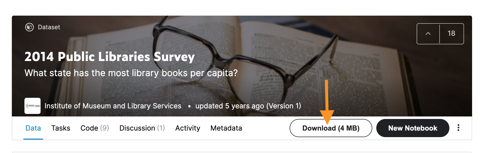

Studio: Tableau Part 4 - Stories and Dates
==========================================

Getting Started
---------------

| This is a group studio.  Your group has been asked to create a visual for the International Fencing Federation (FIE).   Work through the data analysis steps that you have been learning in this program to create your final viz. 

| As a group, explore your data and decide upon: 

1. A business issue or a question you want to explore further.  
#. Next clean, and manipulate the data to create vizzes that provide insight to your business issue or question.  
#. Your final output should be a dashboard that best provides insight on your discoveries.  
#. You will present your dashboard at the end of class.
#. Suggested Topics to Explore:

   #. Weapons
   #. Handedness
   #. Category
   #. Ages
   #. Location and/or Time Zone
   #. What factors predict wins? 
   
| You are not limited to these topics.  If you discover something more interesting, explore away!  

Setting Up the Studio:
^^^^^^^^^^^^^^^^^^^^^^

Download `FIE Fencing Womens Foil data set <https://www.kaggle.com/datasets/amichaelsen/fie-fencing-womens-foil-data>`__. There are 4 csv files. To download all csv files at once, click on the ``Download`` bubble next to the ``New Notebook`` bubble.  An orange arrow is pointing to the ``Download`` bubble in the image below.

#. Open the csv file in Tableau Public.  
#. When you open this data set, you may want to create a relationship between the csv files.

   #. You will explore this in the EDA section below.

#. Here is more information about the `International Fencing Federation <https://fie.org/>`__.

EDA
^^^

1. The dataset contains 4 CSVs. You only need to work with the ones that will provide answers to your questions.

#. Explore the tables and play with the columns you think you might use. 

   #. When you get a viz that you like, ask yourself the following questions:

      A. Why do you like it?  What is it showing?
      #. Would it work better with a calculation or any manipulation?
      #. Would looking at a smaller sample, like the top 100, help?

Cleaning
^^^^^^^^

#. Do you need to clean any of the data you have decided to work with?

   #. Any nulls?  

      A. Are they appropriate for the data?

   #. Any discrepancies?

      A. Hint: ages might need some attention.

Manipulation
^^^^^^^^^^^^

#. Do you need to use any calculations to answer the questions?
#. Thinking of your dashboard, how do you think you would like to present your data to your audience? 
#. In order to do this, do you need:

   #. Filters? 
   #. Groups? 
   #. Parameters? 
   #. Calculations?

Dashboard and Finesse
^^^^^^^^^^^^^^^^^^^^^

1. Create a final dashboard viz that answers the question(s)/topic(s) you explored.
2. Now is a good time to update labels and colors for an easily digestible report.
3. Hide your worksheets

Finishing Touches
^^^^^^^^^^^^^^^^^

| Before you turn in your vizzes:

#. Make sure that they are easy to read. 
#. Review and edit any axes so that they don't contain any file information. 
#. Make sure any filtering, group, or set information is easy to understand. 
#. If you want to explore fonts and colors, go right ahead. 

Present Your Dashboard to the class and provide feedback to your classmates.
^^^^^^^^^^^^^^^^^^^^^^^^^^^^^^^^^^^^^^^^^^^^^^^^^^^^^^^^^^^^^^^^^^^^^^^^^^^^

#. Share even if your group dashboard is not complete, we want to see your unique ideas. 

Submitting Your Work
--------------------

When finished make sure to save and publish your work to your Tableau Public account. Copy the URL to your published Tableau project and paste it into the submission box in 
Canvas for **Studio: Tableau Part 4 - Stories and Dates** and click *Submit*.
